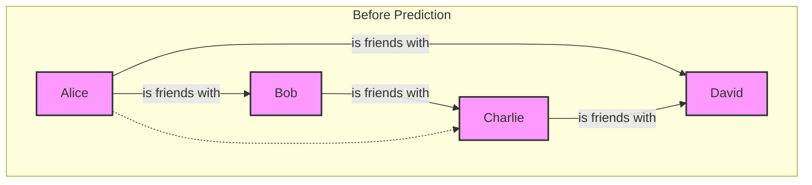
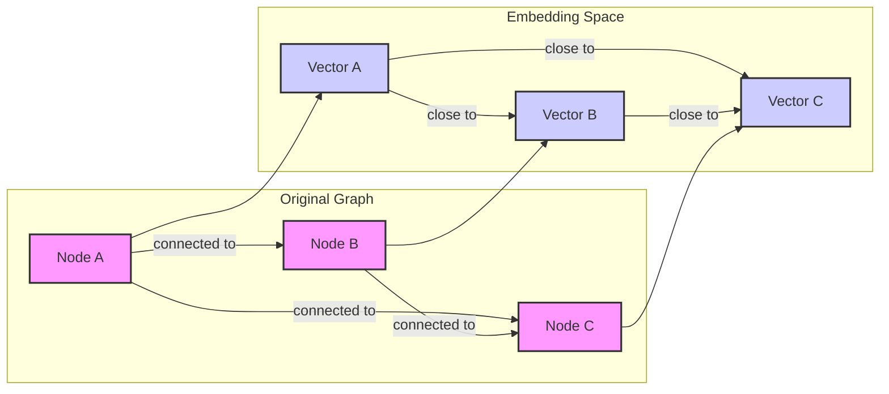
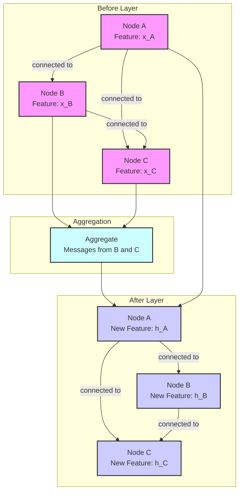

# An Exhaustive Review of "Towards Foundation Models for Knowledge Graph Reasoning"

## 1. Definition of Terms (Introductory Section)

This section provides a comprehensive and accessible introduction to the key technical terms and concepts relevant to the paper "Towards Foundation Models for Knowledge Graph Reasoning" by Galkin et al. The goal is to ensure that readers with varying levels of expertise in machine learning and knowledge graphs can follow the subsequent detailed analysis. Each term is defined with beginner-friendly language, analogies, and real-world examples, and is contextualized to the paper's focus on scalable and generalizable KG reasoning using foundation models.

### 1.1. Knowledge Graphs (KGs)

A Knowledge Graph (KG) is a powerful data structure used to represent a collection of interconnected facts about the world. It organizes information in a way that is both human-readable and machine-processable, forming a vast network of knowledge. This structure is fundamental to many modern AI applications, including search engines, recommendation systems, and question-answering platforms. The paper "Towards Foundation Models for Knowledge Graph Reasoning" leverages KGs as the primary data source for its reasoning tasks, aiming to build models that can understand and infer new knowledge from these complex structures.

#### 1.1.1. Core Concepts: Entities, Relations, and Triples

At the heart of any Knowledge Graph are three fundamental components: **entities**, **relations**, and **triples**. An **entity** represents a real-world object or concept, such as a person, place, organization, or abstract idea. For example, "Albert Einstein," "Princeton University," and "Theory of Relativity" are all entities. A **relation** describes the type of connection or interaction between two entities. Examples of relations include "was born in," "worked at," and "developed." A **triple** is the basic unit of information in a KG, consisting of a subject entity, a predicate (relation), and an object entity. It is typically represented in the format `(subject, predicate, object)`. For instance, the fact "Albert Einstein developed the Theory of Relativity" can be expressed as the triple `(Albert Einstein, developed, Theory of Relativity)`. The paper formalizes a KG as a tuple `G = (V, R, E)`, where `V` is the set of entities (nodes), `R` is the set of relations (edge types), and `E` is the set of triples (edges) . This formal representation allows for rigorous mathematical and computational analysis of the graph structure.

#### 1.1.2. Real-World Analogy: A Web of Interconnected Facts

To better understand the concept of a Knowledge Graph, consider the analogy of a vast, intricate spider's web. Each intersection point in the web represents an **entity** (a person, a place, a thing), and the silk threads connecting these points represent the **relations** (e.g., "is a friend of," "is located in," "is a part of"). A single strand of silk connecting two points, along with the points themselves, forms a **triple**. The entire web, with its countless intersections and connections, forms the Knowledge Graph. Just as a spider can traverse its web to understand the connections between different points, an AI system can traverse a KG to discover relationships and infer new information. For example, if the web contains the connections (`Alice`, `is a friend of`, `Bob`) and (`Bob`, `works at`, `Company X`), a reasoning system could infer a potential connection between Alice and Company X, even if it's not explicitly stated. This ability to navigate and reason over this web of facts is the central theme of the paper, which proposes a foundation model capable of understanding these connections across different "webs" (i.e., different KGs with unique vocabularies) .

#### 1.1.3. Historical Context: From Semantic Web to Modern KGs

The concept of Knowledge Graphs has its roots in the **Semantic Web** movement of the early 2000s, which aimed to make web content more meaningful and understandable to machines. Early standards like the Resource Description Framework (RDF) and the Web Ontology Language (OWL) were developed to represent data in a structured, triple-based format. However, these early efforts were often complex and difficult to scale. The modern concept of KGs gained prominence with the rise of large-scale projects like **Google's Knowledge Graph**, which was introduced in 2012 to enhance its search results with semantic information. This marked a shift from purely academic research to practical, large-scale applications. Since then, KGs have become a cornerstone of many AI systems, powering applications in search, recommendation, and question-answering. The paper by Galkin et al. builds on this rich history by addressing a key limitation of traditional KG methods: their inability to generalize across different graphs. While earlier methods were often "transductive," meaning they could only reason within a single, fixed graph, the proposed ULTRA model is "inductive," allowing it to transfer learned knowledge to entirely new and unseen graphs .

#### 1.1.4. Visual Representation of a KG Structure

A Knowledge Graph is most intuitively understood through a visual representation. Imagine a network diagram where circles represent entities and arrows represent relations.

**Figure 1: A Simple Knowledge Graph**

```mermaid
graph TD
    A[Albert Einstein] -- was born in --> B[Ulm, Germany];
    A -- worked at --> C[Princeton University];
    A -- developed --> D[Theory of Relativity];
    C -- is located in --> E[Princeton, New Jersey];
    D -- is a part of --> F[Physics];

    subgraph Entities
        A;
        B;
        C;
        D;
        E;
        F;
    end

    subgraph Relations
        was born in;
        worked at;
        developed;
        is located in;
        is a part of;
    end
```

In this diagram, each node (e.g., `Albert Einstein`, `Princeton University`) is an entity, and each directed edge (e.g., `was born in`, `worked at`) is a relation. The combination of a source node, an edge, and a target node forms a triple. This visual structure makes it easy to see how information is connected. For example, one can trace a path from `Albert Einstein` to `Princeton, New Jersey` through `Princeton University`. The paper's proposed method, ULTRA, operates on this kind of structure but goes a step further by creating a "graph of relations" to understand the interactions between different types of connections, which is a key innovation for achieving generalization across different KGs .

### 1.2. Knowledge Graph Reasoning (KGR)

#### 1.2.1. Core Task: Inferring New Knowledge from Existing Facts

Knowledge Graph Reasoning (KGR) is the process of deriving new, implicit knowledge from the explicit facts stored in a Knowledge Graph. It is a form of automated logical inference that allows a system to answer complex queries, make predictions, and discover hidden patterns. The core task of KGR is to go beyond the information that is directly stated in the graph and uncover what is logically implied. For example, given the triples (`Steve Jobs`, `was the CEO of`, `Apple Inc.`) and (`Apple Inc.`, `is headquartered in`, `Cupertino, California`), a reasoning system could infer the new triple (`Steve Jobs`, `was the CEO of a company headquartered in`, `Cupertino, California`), even if this specific fact is not explicitly stored. The paper by Galkin et al. focuses on a specific type of KGR known as link prediction, which involves predicting the existence of missing links (relations) between entities. The authors propose a foundation model that can perform this reasoning task not just on a single graph, but across a wide variety of different graphs, a significant step towards more generalizable AI .

#### 1.2.2. Key Reasoning Tasks: Link Prediction and Path Reasoning

Within the field of Knowledge Graph Reasoning, two of the most prominent tasks are **link prediction** and **path reasoning**. **Link prediction**, also known as knowledge graph completion, involves predicting missing triples in a graph. Given a query like `(?, relation, tail_entity)` or `(head_entity, relation, ?)`, the goal is to find the correct missing entity to complete the triple. For example, given `(?, was born in, Ulm, Germany)`, a link prediction model should be able to identify `Albert Einstein` as a likely candidate. **Path reasoning**, on the other hand, involves finding a sequence of relations (a path) that connects two given entities. For instance, to answer the question "How is Albert Einstein connected to Princeton, New Jersey?", a path reasoning model might find the path `Albert Einstein -> worked at -> Princeton University -> is located in -> Princeton, New Jersey`. The paper by Galkin et al. primarily focuses on the link prediction task, using it as a benchmark to evaluate the performance of their proposed foundation model, ULTRA. The model's ability to perform well on this task across 57 different KGs demonstrates its capacity for robust and generalizable reasoning .

#### 1.2.3. Visualizing Link Prediction: Inferring Missing Connections

Link prediction can be visualized as a process of filling in the blanks in a partially completed graph. Imagine a social network graph where some friendship connections are missing. The task of link prediction is to identify these missing links based on the existing connections and the overall structure of the network.

**Figure 2: Visualizing Link Prediction**



In the "Before Prediction" graph, there is a dashed line between Alice and Charlie, representing a potential but unconfirmed friendship. A link prediction model would analyze the graph and, based on the fact that Alice is friends with Bob, and Bob is friends with Charlie, it might infer that Alice and Charlie are also likely to be friends. The model would then "predict" this missing link, turning the dashed line into a solid one. The ULTRA model proposed in the paper performs this type of inference but does so in a way that is transferable across different graphs, meaning it can learn general patterns of connection that apply to many different types of networks .

#### 1.2.4. Visualizing Path Reasoning: Finding Connections Between Entities

Path reasoning can be visualized as finding a route between two points on a map. Given a starting point (an entity) and a destination (another entity), the goal is to find a sequence of roads (relations) that connects them.

**Figure 3: Visualizing Path Reasoning**

```mermaid
graph TD
    A[Albert Einstein] -- was born in --> B[Ulm, Germany];
    A -- worked at --> C[Princeton University];
    C -- is located in --> D[Princeton, New Jersey];
    B -- is located in --> E[Germany];
    D -- is located in --> F[USA];

    subgraph Path from Einstein to Princeton, NJ
        A;
        C;
        D;
    end

    style A fill:#ccf,stroke:#333,stroke-width:2px
    style C fill:#ccf,stroke:#333,stroke-width:2px
    style D fill:#ccf,stroke:#333,stroke-width:2px
```

In this example, to find a connection between `Albert Einstein` and `Princeton, New Jersey`, a path reasoning model would traverse the graph and identify the path: `Albert Einstein -> worked at -> Princeton University -> is located in -> Princeton, New Jersey`. This path provides a logical explanation for the connection between the two entities. While the paper by Galkin et al. focuses more on link prediction, the underlying principles of their model, which involve understanding the structure and interactions within a graph, are also highly relevant to path reasoning tasks. The ability to generalize across different graphs would be equally valuable for path reasoning, as it would allow a model to find connections in new and unfamiliar domains .

### 1.3. Foundation Models

#### 1.3.1. Core Concept: Large-Scale, Pre-trained, and Adaptable Models

A **foundation model** is a large-scale machine learning model that is pre-trained on a vast amount of data and can be adapted to a wide range of downstream tasks. The key idea behind foundation models is to leverage the knowledge learned during pre-training to achieve strong performance on new tasks with minimal fine-tuning. These models are typically based on deep neural network architectures, such as the Transformer, and are trained using self-supervised learning techniques, where the model learns to predict parts of the input data from other parts. This allows them to learn rich, general-purpose representations of the data. The paper by Galkin et al. applies this concept to Knowledge Graphs, proposing a foundation model named ULTRA that is pre-trained on multiple KGs and can then be fine-tuned or used in a zero-shot manner on new, unseen KGs. This approach aims to overcome the limitations of traditional KG models, which are often designed for a specific graph and cannot easily transfer their knowledge to other graphs .

#### 1.3.2. Real-World Analogy: A Versatile Toolbox for AI Tasks

A good analogy for a foundation model is a highly versatile and well-equipped toolbox. Just as a master craftsperson's toolbox contains a wide variety of tools that can be used for many different tasks, a foundation model contains a vast amount of general knowledge that can be applied to a wide range of AI problems. For example, a large language model like GPT-4, which is a type of foundation model, can be used for tasks such as translation, summarization, question-answering, and creative writing, all without being specifically trained for each of these tasks. Similarly, the ULTRA model proposed in the paper can be thought of as a "KG reasoning toolbox." Once it is pre-trained on a diverse set of KGs, it can be used to perform link prediction on a completely new graph, even if that graph has a different set of entities and relations. This versatility is the key advantage of the foundation model approach, as it allows for the development of more generalizable and adaptable AI systems .

#### 1.3.3. Historical Context: The Rise of Large Language Models (LLMs)

The concept of foundation models gained widespread attention with the success of **Large Language Models (LLMs)** like BERT and GPT. These models demonstrated that by pre-training on massive amounts of text data, it was possible to achieve state-of-the-art performance on a wide range of natural language processing tasks. This success inspired researchers to explore the application of the foundation model paradigm to other domains, such as computer vision and, more recently, graph-structured data. The paper by Galkin et al. is part of this broader trend, representing one of the first attempts to develop a foundation model specifically for Knowledge Graph reasoning. The authors draw a direct parallel between their work and the success of LLMs, highlighting the potential for a similar "pre-train and fine-tune" paradigm to revolutionize the field of KG reasoning. The key challenge, as they note, is that unlike language, which has a relatively fixed vocabulary of tokens, KGs have different entity and relation vocabularies that generally do not overlap. The ULTRA model is designed to address this challenge by learning transferable representations that can be applied to any graph, regardless of its specific vocabulary .

#### 1.3.4. Visualizing the Foundation Model Approach to KGR

The foundation model approach to Knowledge Graph Reasoning can be visualized as a two-stage process: pre-training and fine-tuning/zero-shot inference.

**Figure 4: The Foundation Model Paradigm for KGR**

```mermaid
graph LR
    subgraph Pre-training Stage
        A[Diverse KGs<br>(e.g., Freebase, WordNet, Wikidata)] --> B{Foundation Model<br>(e.g., ULTRA)};
    end

    subgraph Inference Stage
        C[New, Unseen KG<br>(e.g., a biomedical KG)] --> B;
        B --> D[Reasoning Task<br>(e.g., Link Prediction)];
    end

    style A fill:#f9f,stroke:#333,stroke-width:2px
    style B fill:#ccf,stroke:#333,stroke-width:2px
    style C fill:#f9f,stroke:#333,stroke-width:2px
    style D fill:#cff,stroke:#333,stroke-width:2px
```

In the **pre-training stage**, the foundation model (ULTRA) is trained on a large and diverse set of KGs. This allows the model to learn general patterns and structures that are common across different domains. In the **inference stage**, the pre-trained model is then used to perform a reasoning task on a new, unseen KG. This can be done in a zero-shot manner, where the model is applied directly to the new graph without any further training, or it can be fine-tuned on a small amount of data from the new graph to adapt it to the specific characteristics of that graph. The key insight of the paper is that the pre-trained ULTRA model can achieve strong performance even in the zero-shot setting, demonstrating its ability to learn transferable representations that are not tied to the specific vocabularies of the training graphs .

### 1.4. Graph Embeddings

#### 1.4.1. Core Concept: Representing Graph Elements as Vectors

Graph embeddings are a fundamental technique in graph representation learning, where the goal is to map the elements of a graph (nodes, edges, or entire subgraphs) into a low-dimensional vector space. The key idea is to create vector representations that preserve the structural and semantic information of the original graph. For example, nodes that are close to each other in the graph should also be close to each other in the vector space. These embeddings can then be used as input to various machine learning models for tasks such as node classification, link prediction, and graph clustering. The paper by Galkin et al. uses graph embeddings as a core component of their proposed method. Specifically, the ULTRA model learns to generate embeddings for relations based on their interactions within a "graph of relations." These relation embeddings are then used by an inductive link prediction model to perform the final reasoning task. The ability to generate meaningful embeddings for unseen relations is a key innovation of the paper .

#### 1.4.2. Real-World Analogy: Mapping a City with Coordinates

A useful analogy for graph embeddings is the process of creating a map of a city. In this analogy, each location in the city (e.g., a landmark, a restaurant, a park) is an entity, and the roads connecting them are the relations. A map represents each location as a point with a specific set of coordinates (a vector). The goal of the map is to preserve the spatial relationships between the locations. For example, locations that are close to each other in the real world should also be close to each other on the map. Similarly, in graph embeddings, the goal is to represent each entity as a vector in a way that preserves its relationships with other entities in the graph. The ULTRA model proposed in the paper can be thought of as a "cartographer" for relations. It creates a "map" of relations, where each relation is assigned a set of coordinates (an embedding) based on how it interacts with other relations in the graph. This "map" of relations can then be used to navigate and reason about the structure of any KG .

#### 1.4.3. Visualizing the Embedding Process

The process of creating graph embeddings can be visualized as a transformation from a high-dimensional, discrete graph structure to a low-dimensional, continuous vector space.

**Figure 5: Visualizing the Graph Embedding Process**



In this visualization, the original graph on the left consists of three nodes (A, B, C) and their connections. The embedding process maps each node to a corresponding vector (A', B', C') in a 2D or 3D space. The key property of this mapping is that the geometric relationships between the vectors reflect the structural relationships between the nodes in the original graph. For example, since nodes A and B are connected, their corresponding vectors A' and B' are close to each other in the embedding space. The ULTRA model extends this idea to relations, creating embeddings that capture the complex interactions between different types of connections in a KG .

### 1.5. Graph Neural Networks (GNNs)

#### 1.5.1. Core Concept: Neural Networks for Graph-Structured Data

Graph Neural Networks (GNNs) are a class of deep learning models specifically designed to operate on graph-structured data. The core idea behind GNNs is to learn a representation (an embedding) for each node in a graph by aggregating information from its neighbors. This process is typically performed in multiple layers, where each layer allows a node to gather information from nodes that are further and further away in the graph. This "message passing" mechanism allows GNNs to capture the local and global structure of the graph, making them highly effective for a wide range of graph-based tasks. The paper by Galkin et al. uses a GNN as a key component of their proposed ULTRA model. Specifically, they apply a GNN to a "graph of relations" to learn representations for each relation based on its interactions with other relations. This is a novel application of GNNs, as they are typically applied to the entity-level graph, not a meta-level graph of relations .

#### 1.5.2. Real-World Analogy: Information Propagation in a Social Network

A good analogy for how GNNs work is the spread of information in a social network. Imagine a new piece of information (e.g., a rumor or a news story) originating at a single person (a node) in the network. This person shares the information with their immediate friends (their neighbors). These friends then share it with their own friends, and so on. Over time, the information propagates through the network, and each person's understanding of the information is shaped by the information they receive from their neighbors. A GNN works in a similar way. In each layer of the network, each node "shares" its current representation with its neighbors, and then "updates" its own representation based on the information it receives. This process allows each node to build up a rich representation that incorporates information from its local neighborhood and, after multiple layers, from the entire graph. The ULTRA model uses this mechanism to allow each relation in the "graph of relations" to learn about its role and its interactions with other relations .

#### 1.5.3. Historical Context: The Emergence of GNN Architectures

The field of Graph Neural Networks has evolved rapidly in recent years, with many different architectures being proposed. Early models like Graph Convolutional Networks (GCNs) and GraphSAGE introduced the basic idea of aggregating information from neighbors. More recent models like Graph Attention Networks (GATs) have incorporated attention mechanisms, allowing the model to learn which neighbors are most important to focus on. The paper by Galkin et al. builds on this rich history of GNN research. While they do not specify the exact GNN architecture used in their experiments, they mention that they use a GNN with a "labeling trick" to break neighborhood symmetries. This is a technique that has been shown to be effective for link prediction tasks, as it allows the model to distinguish between different nodes that have the same local structure. The use of a GNN in the ULTRA model is a key part of its ability to learn rich and informative representations for relations .

#### 1.5.4. Visualizing a GNN Layer

A single layer of a GNN can be visualized as a process of message passing and aggregation.

**Figure 6: Visualizing a Single GNN Layer**



In this visualization, Node A's new feature `h_A` is computed by first aggregating the features of its neighbors (Node B and Node C) and then combining this aggregated message with its own original feature `x_A`. This process is repeated for all nodes in the graph, allowing information to propagate through the network. The ULTRA model uses multiple layers of this process to build a rich, contextual understanding of each relation in its "graph of relations" .

### 1.6. Large Language Models (LLMs)

#### 1.6.1. Core Concept: Models for Understanding and Generating Human Language

Large Language Models (LLMs) are a type of foundation model that has been trained on a massive amount of text data to understand and generate human-like language. They are typically based on the Transformer architecture and have billions of parameters. LLMs have demonstrated remarkable capabilities in a wide range of language-related tasks, including text generation, translation, summarization, and question answering. The key to their success is their ability to learn a rich and nuanced understanding of language from the vast amount of data they are trained on. While the paper by Galkin et al. does not directly use LLMs, the concept of foundation models that they are exploring is closely related to the success of LLMs. The authors are essentially trying to build an "LLM for knowledge graphs," a model that can learn a general understanding of the structure and semantics of knowledge graphs and then be adapted to a wide range of KGR tasks.

#### 1.6.2. Real-World Analogy: A Highly Skilled Translator and Writer

A useful analogy for an LLM is a highly skilled translator and writer who has read an enormous library of books, articles, and websites. This person has an exceptional command of language, a vast vocabulary, and a deep understanding of a wide range of topics. They can not only translate between languages with nuance and accuracy but also write original content on almost any subject, mimicking different writing styles and tones. Just as this expert can understand the subtle meaning in a piece of text and generate a well-crafted response, an LLM can process a user's query, understand its intent, and generate a relevant and coherent answer. This powerful language understanding capability is what makes LLMs a promising tool for enhancing knowledge graph reasoning, as they can help interpret natural language queries and reason over the textual information associated with entities and relations in a KG.

#### 1.6.3. Visualizing the Integration of LLMs with KGs

The integration of LLMs with KGs can be visualized as a symbiotic relationship. On one side, you have the LLM, a powerful language processor that can understand and generate text. On the other side, you have the KG, a structured repository of factual knowledge. The integration would involve using the LLM to translate natural language queries into formal queries that can be executed on the KG. The results from the KG would then be passed back to the LLM, which would use its language generation capabilities to formulate a human-readable answer. This combination would leverage the strengths of both technologies: the LLM's ability to handle the ambiguity and complexity of natural language, and the KG's ability to provide precise, factual answers. This is an active area of research, and the paper "Towards Foundation Models for Knowledge Graph Reasoning" can be seen as a step towards this goal, as it aims to create a foundation model that can reason over KGs in a way that is more similar to how LLMs reason over text.

### 1.7. Evaluation Metrics for KGR

#### 1.7.1. Mean Reciprocal Rank (MRR)

Mean Reciprocal Rank (MRR) is a widely used evaluation metric for knowledge graph reasoning tasks, particularly for link prediction. It measures the average of the reciprocal ranks of the correct answers. For a given query, the model generates a ranked list of possible answers. The reciprocal rank is the inverse of the rank of the first correct answer in this list. For example, if the correct answer is ranked 3rd, the reciprocal rank is 1/3. If the correct answer is not in the top-k predictions, the reciprocal rank is considered to be 0. The MRR is then calculated by averaging the reciprocal ranks over all the queries in the test set. A higher MRR indicates better performance, as it means the model is ranking the correct answers higher on average. The paper "Towards Foundation Models for Knowledge Graph Reasoning" uses MRR as one of its primary evaluation metrics to assess the performance of the ULTRA model.

#### 1.7.2. Hits@N

Hits@N is another common evaluation metric for knowledge graph reasoning. It measures the proportion of correct answers that are ranked in the top N positions of the model's predictions. For example, Hits@10 would be the percentage of queries for which the correct answer is among the top 10 predictions. This metric is useful for evaluating the model's ability to retrieve the correct answer within a small set of candidates. A higher Hits@N score indicates better performance. The paper "Towards Foundation Models for Knowledge Graph Reasoning" reports Hits@N scores for various values of N (e.g., Hits@1, Hits@3, Hits@10) to provide a more comprehensive evaluation of the ULTRA model's performance. These metrics are particularly important for practical applications, where a user might only be interested in the top few predictions.

#### 1.7.3. Visualizing Evaluation Metrics with Plots

Evaluation metrics like MRR and Hits@N can be visualized using plots to provide a more intuitive understanding of a model's performance. For example, a bar chart can be used to compare the MRR or Hits@N scores of different models on the same dataset. A line plot can be used to show how the performance of a model changes as a function of some parameter, such as the number of training epochs or the size of the embedding vectors. These visualizations can be very helpful for identifying trends and patterns in the results, and for communicating the findings of an experiment to a wider audience. The paper "Towards Foundation Models for Knowledge Graph Reasoning" includes several tables and figures that present the evaluation results in a clear and concise manner, allowing for easy comparison with other methods.

### 1.8. Scalability in KGR

#### 1.8.1. Core Concept: Handling Large and Complex Knowledge Graphs

Scalability is a critical issue in knowledge graph reasoning, as real-world KGs can be massive, containing billions of entities and trillions of triples. A scalable KGR model must be able to handle this large scale without a significant increase in computational cost or memory usage. This is a major challenge for many traditional KGR methods, which often have a computational complexity that scales quadratically or even cubically with the size of the graph. The paper "Towards Foundation Models for Knowledge Graph Reasoning" addresses this issue by proposing a model that is designed to be scalable. The ULTRA model uses a GNN-based architecture that can be trained efficiently on large graphs, and its inductive nature means that it can be applied to new graphs without the need for expensive retraining.

#### 1.8.2. Challenges and Solutions for Scalable Reasoning

There are several challenges to achieving scalability in KGR. One of the main challenges is the sheer size of the data, which can make it difficult to store and process the graph in memory. Another challenge is the computational cost of training and inference, which can be prohibitive for large graphs. The paper "Towards Foundation Models for Knowledge Graph Reasoning" proposes several solutions to these challenges. First, the use of a GNN-based architecture allows for efficient training on large graphs by using techniques like mini-batching and sampling. Second, the inductive nature of the model means that it can be applied to new graphs without the need for expensive retraining, which is a major advantage over transductive methods. Finally, the paper's focus on learning transferable representations means that the model can be pre-trained on a large, diverse set of KGs and then fine-tuned on a smaller, task-specific dataset, which can significantly reduce the training time and computational cost.

### 1.9. Knowledge Graph Completion

#### 1.9.1. Core Concept: Filling in Missing Information in a KG

Knowledge graph completion is the task of filling in the missing information in a knowledge graph. This is a critical task, as real-world KGs are often incomplete and contain many missing triples. The goal of knowledge graph completion is to predict these missing triples based on the existing information in the graph. This can be done using a variety of methods, including rule-based systems, statistical models, and machine learning algorithms. The paper "Towards Foundation Models for Knowledge Graph Reasoning" focuses on the task of link prediction, which is a key component of knowledge graph completion. By predicting missing links, the ULTRA model can help to enrich and complete the knowledge graph, making it a more valuable resource for downstream applications.

#### 1.9.2. Relationship with Link Prediction

Link prediction is a core task in knowledge graph completion. It involves predicting the existence of a relationship between two entities in the graph. This is often framed as a query of the form `(h, r, ?)`, where the goal is to find the most likely tail entity `t` to complete the triple, or `(?, r, t)`, where the goal is to find the most likely head entity `h`. The paper "Towards Foundation Models for Knowledge Graph Reasoning" uses link prediction as a benchmark to evaluate the performance of the ULTRA model. The model's ability to perform well on this task across a wide range of KGs demonstrates its potential for knowledge graph completion. By accurately predicting missing links, the ULTRA model can help to make knowledge graphs more complete and useful for a variety of applications.

### 1.10. Semantic Reasoning

#### 1.10.1. Core Concept: Understanding the Meaning Behind Data

Semantic reasoning is the process of understanding the meaning behind data and using this understanding to make inferences and deductions. In the context of knowledge graphs, this means understanding the semantics of the entities and relations in the graph and using this understanding to reason about the data. This is a key challenge in KGR, as the meaning of the data is often implicit and not explicitly stated. The paper "Towards Foundation Models for Knowledge Graph Reasoning" addresses this challenge by proposing a model that learns to reason about the semantics of the relations in the graph. By learning a representation of the relations that is conditioned on their interactions with other relations, the ULTRA model can capture the semantic meaning of the data and use it to make more accurate predictions.

#### 1.10.2. Role in KGR and Foundation Models

Semantic reasoning plays a crucial role in KGR and foundation models. By understanding the meaning behind the data, a model can make more accurate and robust predictions, even in the presence of noisy or incomplete data. This is particularly important for foundation models, which are designed to be generalizable and adaptable to a wide range of tasks and domains. The paper "Towards Foundation Models for Knowledge Graph Reasoning" demonstrates the importance of semantic reasoning by showing that the ULTRA model can achieve state-of-the-art performance on a variety of KGR tasks. By learning a deep and nuanced understanding of the semantics of the data, the ULTRA model is able to make more accurate predictions and to generalize to new, unseen graphs.
