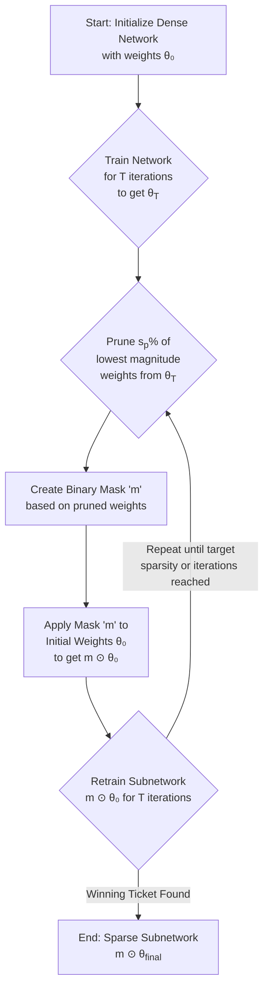

# Exhaustive Review of "The Lottery Ticket Hypothesis: Finding Sparse, Trainable Neural Networks"

## 1. Definition of Terms: Demystifying the Lottery Ticket Hypothesis

The "Lottery Ticket Hypothesis" (LTH), introduced by Jonathan Frankle and Michael Carbin in their 2018 paper (published at ICLR 2019) , has sparked significant interest and research in the field of machine learning, particularly in understanding and optimizing neural network training. The core idea revolves around the existence of sparse, trainable subnetworks within larger, randomly initialized neural networks. These subnetworks, dubbed "winning tickets," can, when trained in isolation, achieve performance comparable to the original, dense network, often with faster training and fewer parameters. To fully grasp the nuances of the LTH and its implications, it is essential to first understand a set of foundational machine learning concepts and specific terms central to the hypothesis. This section aims to provide an exhaustive and accessible definition of these terms, catering to readers with varying levels of machine learning expertise. We will explore general ML concepts, delve into terms specific to the LTH, explain the Iterative Magnitude Pruning (IMP) algorithm, and discuss how sparsity and the IMP process can be visualized. The goal is to build a solid conceptual foundation before dissecting the paper's technical details, historical context, and practical applications in subsequent sections of this review.

### 1.1 Foundational Machine Learning Concepts

Before diving into the specifics of the Lottery Ticket Hypothesis, it's crucial to establish a solid understanding of several foundational machine learning concepts that underpin the research. These concepts are not unique to the LTH paper but are fundamental to the field of deep learning and neural networks in general. A clear grasp of these ideas will make the intricacies of the LTH more accessible.

**Neural Networks:** At their core, **neural networks** are computational models inspired by the structure and function of biological neural networks, such as the human brain. They consist of interconnected layers of processing units called neurons or nodes. Each connection between neurons has an associated weight, and each neuron typically has a bias term and an activation function. Information flows through the network, with each neuron receiving input from the previous layer, performing a computation (usually a weighted sum of inputs followed by the application of an activation function), and passing its output to the next layer. Neural networks are capable of learning complex patterns and relationships from data, making them powerful tools for tasks like image recognition, natural language processing, and speech recognition. The LTH paper focuses on feed-forward neural networks, where connections do not form cycles, meaning information moves in one direction, from the input layer, through hidden layers (if any), to the output layer . The architecture of a neural network refers to its layout, including the number of layers, the number of neurons in each layer, and how they are connected.

**Supervised Learning:** This is a type of machine learning where the model is trained on a **labeled dataset**. Each training example consists of an input data point (e.g., an image) and a corresponding desired output label (e.g., "cat" or "dog"). The goal of supervised learning is to learn a mapping function from the input to the output, such that the model can accurately predict the label for new, unseen data points. During training, the model makes predictions, and its performance is evaluated by comparing these predictions to the true labels using a loss function. The parameters of the model (weights and biases) are then adjusted to minimize this loss. The LTH paper primarily deals with supervised learning tasks, such as image classification on datasets like MNIST and CIFAR-10 , where the network learns to classify images into predefined categories.

**Overfitting:** **Overfitting** occurs when a machine learning model learns the training data too well, including its noise and irrelevant details, to the extent that it negatively impacts the model's ability to generalize to new, unseen data. An overfit model will typically have high accuracy on the training data but perform poorly on the test data (data it has not seen during training). This happens because the model has essentially memorized the training examples rather than learning the underlying patterns that generalize. Techniques to prevent overfitting include regularization, dropout, early stopping, and using more training data. The LTH paper's focus on finding smaller, well-performing subnetworks can be seen as a way to combat overfitting by reducing model complexity .

**Gradient Descent:** **Gradient descent** is a first-order iterative optimization algorithm used to find the minimum of a function, typically a loss function in machine learning. The core idea is to iteratively adjust the model's parameters (weights and biases) in the opposite direction of the gradient (or slope) of the loss function with respect to those parameters. The size of each step is determined by a hyperparameter called the learning rate. If the learning rate is too small, the convergence will be slow; if it's too large, the algorithm might overshoot the minimum or even diverge. Variants of gradient descent include Stochastic Gradient Descent (SGD), where updates are made based on a single training example or a small batch of examples, making it faster and more suitable for large datasets. The LTH paper involves training neural networks using gradient descent-based methods to optimize their parameters .

**Backpropagation:** **Backpropagation**, short for "backward propagation of errors," is an algorithm used to efficiently calculate the gradient of the loss function with respect to each weight in a neural network. It works by applying the chain rule of calculus to compute the gradients layer by layer, starting from the output layer and moving backward towards the input layer. Once the gradients are computed, they are used by an optimization algorithm like gradient descent to update the weights. Backpropagation is a fundamental algorithm for training neural networks and is implicitly used in the training processes described in the LTH paper .

**Loss Functions:** A **loss function** (also called a cost function or objective function) quantifies how well a machine learning model's predictions match the true target values. The goal during training is to minimize this function. For classification tasks, common loss functions include cross-entropy loss, while for regression tasks, mean squared error (MSE) is often used. The choice of loss function depends on the specific problem being solved. The LTH paper evaluates the performance of networks based on their test accuracy, which is directly related to the minimization of a classification loss function during training .

**Regularization:** **Regularization** techniques are used to prevent overfitting by adding a penalty term to the loss function. This penalty discourages the model from learning overly complex patterns or relying too heavily on specific features. L1 regularization adds a penalty proportional to the absolute value of the weights, which can lead to sparse models (many weights become zero). L2 regularization adds a penalty proportional to the square of the weights, which tends to shrink all weights towards zero but rarely makes them exactly zero. Dropout is another popular regularization technique where randomly selected neurons are ignored during training, which helps prevent co-adaptation of features. While the LTH paper doesn't primarily focus on these specific regularization techniques, the concept of finding sparse subnetworks can be viewed as a form of structural regularization .

**Weight Initialization:** The **initial values** assigned to the weights of a neural network before training begins can significantly impact the training dynamics and the final performance of the model. Poor initialization can lead to issues like vanishing or exploding gradients, making training difficult or impossible. Common initialization strategies include setting weights to small random values (e.g., from a Gaussian or uniform distribution) or using more sophisticated methods like Xavier/Glorot initialization or He initialization, which aim to maintain the variance of activations and gradients across layers. The LTH paper places a strong emphasis on the role of initialization, hypothesizing that "winning tickets" are subnetworks that have won the "initialization lottery," meaning their specific initial weights make them particularly amenable to effective training .

**Optimization:** In the context of machine learning, **optimization** refers to the process of adjusting the parameters of a model to minimize a loss function. This is typically done using iterative algorithms like gradient descent and its variants (e.g., Adam, RMSprop). The optimization process involves repeatedly computing the gradient of the loss function with respect to the model parameters and updating the parameters in the direction that reduces the loss. The LTH paper's methodology involves training networks to convergence, which is an optimization process .

**Generalization:** **Generalization** refers to a model's ability to perform well on new, unseen data after being trained on a specific dataset. A model that generalizes well has learned the underlying patterns in the training data rather than just memorizing it. Good generalization is the ultimate goal of most machine learning tasks. The LTH paper evaluates the "winning tickets" based on their test accuracy, which is a measure of their generalization capability .

**Pruning:** **Neural network pruning** is a technique used to reduce the size of a trained neural network by removing unnecessary parameters (weights or connections) or even entire neurons or layers. The goal is to create a smaller, more computationally efficient model that retains as much of the original model's accuracy as possible. Pruning can be unstructured, where individual weights are removed, or structured, where larger components like neurons or channels are removed. The LTH paper specifically uses iterative magnitude pruning, an unstructured pruning method, to find "winning tickets" . Pruning is crucial for deploying models on resource-constrained devices and for speeding up inference.

**Sparsity:** In the context of neural networks, **sparsity** refers to the property of having a significant portion of its parameters (weights) be exactly zero . A sparse network is one where many connections are effectively removed. Sparsity is a direct outcome of pruning. The LTH paper aims to find highly sparse subnetworks (winning tickets) that are still trainable to high accuracy . High sparsity can lead to reduced model storage, faster computation (as multiplications by zero can be skipped), and lower energy consumption. The degree of sparsity is often measured as the percentage of zero weights in the network. For example, a 90% sparse network has 90% of its weights set to zero.

**Dense Networks:** A **dense neural network** is one where most of the weights are non-zero. Standard neural networks are typically dense. In contrast, a sparse network, as defined above, has a large fraction of its weights set to zero. The LTH paper starts with a dense, randomly-initialized network and aims to discover a sparse subnetwork within it that can be trained effectively . The transition from a dense to a sparse network through pruning is a core part of the LTH methodology.

**Subnetworks:** A **subnetwork**, in the context of the LTH, refers to a smaller network that is derived from a larger, original dense network by pruning away some of its connections (setting their weights to zero) . The LTH posits that these subnetworks, when initialized correctly and trained in isolation, can achieve performance comparable to the original dense network . A subnetwork can be defined by a binary mask that indicates which weights from the original network are retained (mask value 1) and which are pruned (mask value 0).

### 1.2 Core Concepts Specific to the Lottery Ticket Hypothesis

The Lottery Ticket Hypothesis introduces several key concepts that are central to understanding its claims and methodology. These terms build upon the foundational ML concepts but are specifically defined or heavily emphasized within the context of this research.

**The Lottery Ticket Hypothesis (LTH):** This is the central conjecture of the paper. The LTH posits that a randomly-initialized, dense neural network contains a sparse subnetwork (a "winning ticket") that, when trained in isolation from its *original* initialization, can achieve test accuracy comparable to the original, fully trained dense network, often in a similar or fewer number of training iterations . Formally, as stated in the paper: "A randomly-initialized, dense neural network contains a subnetwork that is initialized such that—when trained in isolation—it can match the test accuracy of the original network after training for at most the same number of iterations" . This hypothesis challenges the conventional wisdom that large, dense networks are inherently necessary for achieving high performance, suggesting instead that their success might be due to the presence of these fortuitously initialized, smaller subnetworks. The LTH implies that the initialization plays a crucial role not just in the trainability of the full network but specifically in the existence and trainability of these effective sparse subnetworks.

**Winning Ticket:** A **"winning ticket"** is the specific sparse subnetwork identified within a larger, randomly-initialized dense neural network that, when trained in isolation from its original initialization, validates the Lottery Ticket Hypothesis . The paper describes these winning tickets as having "won the initialization lottery: their connections have initial weights that make training particularly effective" . The key characteristics of a winning ticket are:
1.  **Sparsity:** It is a significantly smaller network, with many weights pruned (set to zero).
2.  **Trainability:** It can be trained from scratch (using its original initialization) to reach high accuracy.
3.  **Performance:** It matches or even exceeds the test accuracy of the original dense network.
4.  **Efficiency:** It often trains faster or requires fewer iterations to converge than the original network.
The discovery of winning tickets suggests that the optimization landscape of neural networks might be more structured than previously thought, with specific, sparse pathways leading to good solutions.

**Iterative Magnitude Pruning (IMP):** This is the specific algorithm used by Frankle and Carbin to identify winning tickets . IMP is an iterative process that involves repeatedly training the network, pruning a small percentage of the weights with the lowest magnitudes, and then resetting the remaining weights to their initial values before the next round of training. The blog post by Cameron R. Wolfe outlines the steps as:
1.  Begin with a fully-trained, dense model.
2.  Select and prune the lowest magnitude weights in the network.
3.  Rewind remaining subnetwork parameters to their initial, random values.
4.  Train the subnetwork to convergence.
5.  Repeat steps (2)-(4) until the desired pruning ratio is achieved .
The LTH paper itself describes a similar process, emphasizing the resetting of weights to their original initial values (θ₀) after each pruning step . This iterative approach is found to be more effective at finding smaller winning tickets compared to one-shot pruning (where a large percentage of weights are pruned in a single step).

**Rewinding/Resetting to Initialization:** A critical and unique aspect of the LTH methodology is the step of **resetting the weights of the pruned subnetwork back to their *original initial values*** (from the initial dense network) before retraining it in the next iteration of IMP . This is distinct from simply fine-tuning the remaining weights after pruning. The paper shows that if the winning ticket's weights are randomly re-initialized instead of being reset to their original values, its performance significantly degrades . This underscores the importance of the specific "winning" initialization. The term "rewinding" is often used in subsequent literature to describe this step. This procedure suggests that the initial state of the network contains crucial information that guides the training of the sparse subnetwork effectively.

**Unstructured Pruning:** The LTH paper primarily focuses on **unstructured pruning**, where individual weights in the network can be set to zero, irrespective of their location within a layer or their connection to specific neurons or filters . This type of pruning can achieve very high levels of sparsity because it has the fewest constraints. However, the resulting sparse weight matrices may not directly translate to computational speedups on standard hardware without specialized libraries or hardware designed for sparse matrix operations. The blog post by Cameron R. Wolfe contrasts this with structured pruning, which removes larger structural components like entire neurons or filters, leading to dense, smaller networks that are easier to accelerate on general-purpose hardware . The LTH's focus on unstructured pruning allows for a more fine-grained search for these "winning" sparse connectivity patterns.

**One-Shot Pruning vs. Iterative Pruning:** The LTH paper compares **one-shot pruning** with **iterative pruning** for finding winning tickets . One-shot pruning involves training the network once, pruning a target percentage of weights, and then resetting the remaining weights to their initial values. Iterative pruning, as described for IMP, involves multiple cycles of training, pruning a small fraction of remaining weights, and resetting. The paper's results show that iterative pruning is more effective at finding smaller winning tickets that can match the accuracy of the original network .

### 1.3 The Iterative Magnitude Pruning (IMP) Algorithm

The **Iterative Magnitude Pruning (IMP)** algorithm is the cornerstone methodology introduced in the Lottery Ticket Hypothesis paper for identifying these "winning ticket" subnetworks . It is a specific, iterative procedure that differs from one-shot pruning methods. Understanding the steps of IMP is crucial to grasping how the LTH is validated. The algorithm can be broken down into the following key stages, which are repeated over several iterations:

1.  **Initialization and First Training:**
    *   A dense neural network is initialized with random weights, denoted as W₀.
    *   This original dense network is trained on the target task (e.g., image classification on CIFAR-10) for a certain number of iterations or until convergence. This results in a set of trained weights, W.

2.  **Pruning:**
    *   After the initial training (or a subsequent retraining phase), a certain percentage of the weights with the smallest magnitudes (absolute values) are identified for pruning. For example, the lowest 20% of weights might be pruned in each iteration.
    *   These selected weights are then removed from the network, effectively setting their values to zero. This creates a "mask" (M) that represents the connectivity pattern of the subnetwork, where 1 indicates a retained weight and 0 indicates a pruned weight. The sparsity of the network increases with each pruning iteration.

3.  **Rewinding Weights:**
    *   This is a critical step that distinguishes IMP from many other pruning methods. Instead of continuing to train the pruned network from its current state or a new random initialization, the weights of the *remaining* (unpruned) connections in the subnetwork are reset back to their original initial values W₀ (specifically, W₀ ⊙ M, where ⊙ denotes element-wise multiplication).
    *   The idea is to preserve the "winning" initial conditions that made this particular subnetwork trainable.

4.  **Retraining the Subnetwork:**
    *   The sparse subnetwork, now with its weights rewound to their initial values, is retrained on the same task. During this retraining phase, only the unpruned weights are updated.
    *   The retraining is typically done for the same number of iterations as the initial training or until convergence.

5.  **Iteration:**
    *   Steps 2 (Pruning), 3 (Rewinding Weights), and 4 (Retraining the Subnetwork) are repeated iteratively.
    *   In each iteration, a further percentage of the remaining weights are pruned based on their magnitudes after the most recent retraining.
    *   This iterative process continues until a target sparsity level is reached, or until the performance of the subnetwork degrades significantly below that of the original dense network.

The rationale behind IMP is that by iteratively removing less important weights (those with small magnitudes) and consistently resetting the remaining subnetwork to its initial state, the algorithm can uncover a sparse subnetwork that was, in a sense, "destined" to perform well from the very beginning due to its fortunate initialization. The LTH paper presents experimental evidence showing that subnetworks found using IMP, when trained from their original initialization, can match or even exceed the performance of the original dense network, especially at moderate sparsity levels . This iterative pruning and rewinding process is central to the discovery of these "winning tickets." The computational cost of IMP can be high, as it involves multiple cycles of training, pruning, and rewinding, essentially requiring the training of the full network (or large parts of it) several times over. However, the resulting sparse networks offer benefits in terms of inference speed, model size, and potentially faster training if the winning ticket could be identified more efficiently. The method highlights the importance of both the network architecture (the connectivity pattern of the subnetwork) and the specific initial weight values for successful training of sparse models.

The detailed steps of the IMP algorithm, as outlined in the paper's "central experiment" , are as follows:
1.  **Random Initialization**: A neural network \(f(x; \theta_0)\) is initialized with random weights \(\theta_0\) drawn from a specified distribution \(D_\theta\). This initial state of the network is critical, as the "winning ticket" is intrinsically linked to these specific initial weight values.
2.  **Training**: The network is trained for a predetermined number of iterations, \(j\), or until convergence, resulting in a set of trained parameters \(\theta_j\). This training phase allows the network to learn from the data and for the weights to adjust from their initial random values.
3.  **Pruning**: A certain percentage, \(p\%\), of the parameters (weights) in the trained network \(\theta_j\) are pruned. The pruning criterion is typically based on the magnitude of the weights, meaning the weights with the smallest absolute values are removed. This creates a binary mask \(m\) that identifies which weights are kept (mask value 1) and which are pruned (mask value 0). The paper notes that for iterative pruning, this step prunes \(p^{1/n}\%\) of the weights that survived the previous round, where \(n\) is the total number of pruning rounds .
4.  **Resetting**: The remaining, unpruned parameters are reset to their original initial values \(\theta_0\). This step is crucial and distinguishes IMP from standard pruning techniques that might fine-tune the remaining weights or reinitialize them with new random values. The subnetwork \(f(x; m \odot \theta_0)\) is then formed, where \(\odot\) denotes element-wise multiplication.
5.  **Iteration**: Steps 2 through 4 are repeated for \(n\) rounds. In each subsequent round, a further fraction of the remaining weights is pruned based on their magnitudes after the preceding training phase. The process continues until a target sparsity level is reached or the performance of the pruned and reset subnetwork drops below an acceptable threshold.

The authors found that this iterative pruning and resetting strategy was more effective at finding smaller, high-performing subnetworks compared to a "one-shot" pruning approach, where a larger percentage of weights is pruned in a single step after the initial training . The intuition is that iterative pruning allows the network to adapt gradually to the reduced capacity, and resetting to the original initialization preserves the "winning" characteristics of the subnetwork's initial state. The paper explores various hyperparameters of this process, such as the pruning rate per iteration and the learning rate schedules, particularly noting that for deeper networks, learning rate warmup was necessary to find winning tickets at higher learning rates . The IMP algorithm, therefore, is not just a pruning technique but a discovery process for identifying fortuitous initializations and sparse architectures that are particularly amenable to training.

### 1.4 Visualizing Sparsity and the IMP Process

Visual aids can significantly enhance the understanding of abstract concepts like sparsity and the IMP algorithm. While the LTH paper itself contains figures illustrating its results, creating more general visualizations can help demystify the process for a broader audience.

**Visualizing Sparsity: Dense vs. Sparse Networks:**
One can visualize a **dense neural network** as a fully connected graph, where each node represents a neuron and each edge represents a connection with an associated weight. In a typical dense layer, every neuron in one layer is connected to every neuron in the next layer, resulting in a dense mesh of connections.
A **sparse network**, on the other hand, would have many of these connections removed (weights set to zero). This can be visualized by a graph where many edges are missing, leading to a less densely connected structure. The sparsity level can be indicated by the proportion of missing edges. For example, a 50% sparse layer would have half of its connections removed. This visual contrast helps to understand how pruning reduces model complexity and parameter count.

**Visualizing the IMP Process:**
A flowchart or an animated diagram can effectively illustrate the iterative nature of IMP:
1.  **Start:** A dense network with initial weights W₀.
2.  **Train:** The network is trained, resulting in weights W.
3.  **Prune:** A visualization could show weights as dots on a number line (representing their magnitudes), and the smallest magnitude weights are highlighted and then removed. This step creates a sparser network.
4.  **Rewind:** An animation could show the remaining weights "snapping back" to their original positions on the number line (their initial values W₀).
5.  **Retrain:** The sparse subnetwork is trained again, but only the remaining (unpruned) weights are updated.
6.  **Iterate:** Arrows would loop back from "Retrain" to "Prune," indicating the repetition of pruning, rewinding, and retraining.
A plot showing accuracy vs. sparsity level (or iteration number) can also be very insightful. This plot would typically show the performance of the subnetwork found by IMP (when trained from its original initialization) compared to the original dense network and perhaps a subnetwork trained from a random initialization. The LTH paper's Figure 1, for instance, shows that randomly sampled subnetworks perform worse as sparsity increases, while IMP-found subnetworks (winning tickets) can maintain or even improve performance up to a certain sparsity level .

**Visualizing Weight Distributions:**
Histograms showing the distribution of weight magnitudes before and after pruning can also be informative. Before pruning, weights might follow a bell-shaped distribution. After pruning, the distribution would show a significant peak at zero (for the pruned weights) and a modified distribution for the remaining non-zero weights. Iterative pruning would progressively shift more and more weights to the zero bin.

These visualizations, while simplified, can make the concepts of sparsity, pruning, and the IMP algorithm more tangible, especially for those new to the field. They help to illustrate how the LTH proposes to find efficient, high-performing subnetworks hidden within larger, over-parameterized models.

A conceptual flowchart for the IMP algorithm can be detailed as follows:



*Figure 1: Flowchart of the Iterative Magnitude Pruning (IMP) Algorithm.*

This flowchart outlines the key stages:
1.  **Initialization**: The process starts with a dense, randomly initialized neural network.
2.  **Training**: The dense network is trained on the target dataset for a specified number of iterations or until convergence.
3.  **Pruning**: After training, a certain percentage ($s_p$) of the weights with the smallest absolute values are identified for removal. This is typically done globally across the network or layer-wise.
4.  **Mask Creation**: A binary mask 'm' is generated where 0s correspond to pruned weights and 1s to retained weights.
5.  **Weight Resetting**: Crucially for LTH, the remaining unpruned weights are reset to their values from the *initial* random initialization ($\theta_0$), not the values they had after the most recent training phase. This creates the sparse subnetwork $m \odot \theta_0$.
6.  **Retraining**: This sparse subnetwork, with its specific architecture and original initialization, is then retrained.
7.  **Iteration**: Steps 3 through 6 are repeated. In each iteration, a further fraction of the *remaining* weights is pruned based on their magnitudes after the latest retraining. This iterative process continues until a predefined target sparsity is achieved or a set number of pruning cycles is completed.
The final output is a highly sparse subnetwork, the "winning ticket," which, according to the LTH, is capable of achieving performance comparable to the original dense network when trained in isolation. This visual representation helps in understanding the sequential and iterative nature of IMP and the critical role of weight resetting.

## 2. Reviewer Role: A Deep Dive into the LTH Paper

### 2.1 Comprehensive Summary of the LTH Paper

The paper **"The Lottery Ticket Hypothesis: Finding Sparse, Trainable Neural Networks"** by Jonathan Frankle and Michael Carbin, published at ICLR 2019 (arXiv:1803.03635), introduces a novel perspective on neural network initialization and pruning . The central claim, termed the **"Lottery Ticket Hypothesis,"** posits that within a dense, randomly-initialized neural network, there exist sparse subnetworks (dubbed **"winning tickets"**) that, when trained in isolation from their original initial weights, can achieve test accuracy comparable to the original, full network. Furthermore, these winning tickets can often achieve this performance in a similar or even fewer number of training iterations. The authors argue that these subnetworks are effective not merely due to their architecture but because their initial weights are fortuitously well-suited for training—they have **"won the initialization lottery"** . This hypothesis challenges the prevailing notion that overparameterization is strictly necessary for training deep neural networks effectively, suggesting instead that the *right* sparse subnetwork, with the *right* initialization, is sufficient.

The methodology employed to identify these winning tickets is a variation of **iterative magnitude pruning (IMP)**. The process involves several key steps, repeated iteratively . First, a dense neural network is initialized and trained to convergence. Then, a fraction of the weights with the smallest magnitudes are pruned (set to zero). Crucially, the remaining unpruned weights are then reset to their *original initial values* (from before the first training round). This pruned subnetwork, with its original initialization, is then retrained. This cycle of training, pruning the smallest magnitude weights, and resetting to initial weights is repeated until a target sparsity level is achieved or performance degrades significantly. The paper emphasizes that this **"rewinding" of weights to their initial values is critical**; simply fine-tuning the pruned network from its final trained weights does not yield the same "winning ticket" phenomenon . The identified sparse subnetwork, when trained from this specific initialization, constitutes the winning ticket.

The experimental validation of the Lottery Ticket Hypothesis was conducted on several standard benchmark datasets and neural network architectures. The primary datasets used were **MNIST and CIFAR-10** . For MNIST, the authors experimented with fully-connected networks of varying depths and widths. For CIFAR-10, they used convolutional architectures, including a small convolutional network (referred to as Conv-2/4/6, indicating the number of convolutional layers) and variants of VGG-like networks. The key evaluation metric was **test accuracy**. The paper compared the performance of these winning tickets against several baselines: the original dense network, randomly pruned subnetworks (where weights are pruned randomly instead of by magnitude), and randomly re-initialized subnetworks (where the architecture of the winning ticket is used, but with a new random initialization). The results consistently showed that the winning tickets found through IMP (with weight resetting) could match or even exceed the performance of the original dense network, often at sparsity levels of **80-90%** (meaning only 10-20% of the original weights remained). These winning tickets also learned faster than the original network, especially at moderate sparsity levels. In contrast, randomly pruned subnetworks or subnetworks trained with new random initializations performed significantly worse, highlighting the importance of both the specific sparse architecture *and* the original initialization .

The paper's findings suggest that the success of these winning tickets is tied to the initial conditions of the weights. The authors hypothesize that the initial weights of a winning ticket are such that they facilitate effective training, perhaps by ensuring good signal propagation or by avoiding issues like vanishing/exploding gradients early in training. The iterative pruning process is seen as a way to uncover these "lucky" initializations by progressively removing weights that are less critical or potentially detrimental if they were to be re-initialized poorly. The implications are significant: if such sparse, trainable subnetworks exist at initialization, it opens up possibilities for more efficient training regimes and the creation of compact, high-performance models without the need to train large, overparameterized networks first. The paper also explored the sensitivity of winning tickets to different hyperparameters, such as the pruning rate per iteration and the learning rate schedule, finding that while winning tickets are robust to some changes, the precise conditions for their discovery can be important . The work has spurred considerable follow-up research into understanding why winning tickets exist, how to find them more efficiently, and how to scale these findings to larger and more complex neural network architectures.

The experimental setup involved testing the hypothesis on several standard benchmarks. For fully-connected networks, the **Lenet-300-100 architecture** was evaluated on the MNIST dataset. For convolutional networks, variants of **VGG (Conv-2, Conv-4, Conv-6)** and **Resnet-18** were tested on CIFAR-10, and **VGG-19** was also adapted for CIFAR-10 . The paper details the specific configurations of these architectures, including the number of convolutional layers, fully connected layers, and total parameters (e.g., Lenet with 266K parameters, VGG-19 with 20.0M parameters). The optimization strategies included SGD, momentum, and Adam, often with techniques like dropout, weight decay, and batch normalization. A key evaluation metric was the test accuracy achieved by the pruned subnetwork when trained for a number of iterations comparable to the original network. The paper also tracked the iteration at which early stopping would occur (based on minimum validation loss) as a proxy for learning speed. The results consistently showed that winning tickets, often less than 10-20% the size of the original network, could match or even exceed the performance of the original network, and crucially, that randomly reinitializing these winning tickets led to significantly worse performance, highlighting the importance of the original initialization . The authors also explored the sensitivity of their findings to hyperparameters like learning rates and pruning rates, noting that for deeper networks, learning rate warmup was often necessary to successfully find winning tickets . The paper concludes by suggesting that the existence of winning tickets has implications for improving training performance, designing better network architectures and initializations, and advancing the theoretical understanding of neural network optimization and generalization.

### 2.2 Exhaustive Technical Critique: Strengths

The Lottery Ticket Hypothesis (LTH) paper by Frankle and Carbin  presents several significant strengths that have contributed to its widespread impact and the subsequent surge of research in neural network pruning and initialization. One of the most prominent strengths is the **novelty and conceptual clarity of the central hypothesis**. The idea that dense, randomly initialized neural networks contain sparse "winning tickets" that can be trained in isolation to achieve comparable performance is both counter-intuitive and profound. It reframes the understanding of why overparameterized networks train effectively, suggesting that their success might not be due to sheer size alone, but rather to the presence of these fortuitously initialized, smaller subnetworks. The authors articulate this hypothesis with remarkable clarity, making the core concept accessible and compelling. This conceptual breakthrough has opened up new avenues for research into network efficiency, initialization strategies, and the fundamental principles of deep learning.

Another key strength lies in the **rigor and thoroughness of the experimental validation**. The paper systematically tests the LTH across a variety of standard benchmark datasets (MNIST, CIFAR-10) and diverse neural network architectures, including fully-connected networks and convolutional networks like Lenet and VGG variants . The authors meticulously compare the performance of their found "winning tickets" against several strong baselines, such as the original dense networks, randomly pruned subnetworks, and subnetworks with random re-initializations. This comprehensive experimental design allows for a robust assessment of the hypothesis. The consistent observation that winning tickets, identified through Iterative Magnitude Pruning (IMP) with weight resetting, can match or even exceed the performance of the original dense networks—often at high sparsity levels (e.g., 80-90%) and with faster training convergence—provides compelling empirical evidence for the LTH. The careful ablation studies, such as demonstrating the critical importance of resetting weights to their *original* initial values rather than new random values, further solidify the paper's claims.

The **practical implications** highlighted by the LTH constitute another significant strength. The discovery of highly sparse, yet highly performant, subnetworks has direct relevance for creating more efficient neural network models. If such "winning tickets" can be reliably found, they offer a pathway to **reduce model size, decrease computational requirements for both training and inference, and lower energy consumption** . This is particularly crucial for deploying machine learning models on resource-constrained devices, such as mobile phones, embedded systems, and edge computing platforms, where memory, power, and processing capabilities are limited. The paper effectively communicates these potential benefits, framing the LTH not just as a theoretical curiosity but as a practical approach to model compression and acceleration. This focus on real-world applicability has undoubtedly contributed to the paper's broad appeal and the motivation for further research into scalable and efficient methods for finding winning tickets.

Furthermore, the **clarity of presentation and the provision of open-source contributions** (though not explicitly mentioned in the provided snippets, the availability of code is a common practice for impactful ML papers and greatly aids reproducibility and further research) are also noteworthy strengths. The paper is well-structured, with a logical flow from the introduction of the hypothesis to the detailed description of the IMP algorithm, experimental setup, results, and discussion of implications. The methodology is described with sufficient detail to allow other researchers to replicate and build upon the work. The clear articulation of the "rewinding" step in IMP, which distinguishes it from conventional pruning methods, is particularly important. By making the research accessible and its core findings reproducible, the authors have fostered a fertile ground for subsequent investigations and advancements in the field. The LTH paper effectively combines a novel conceptual insight with rigorous experimentation and clear communication, making it a landmark contribution in the study of neural network efficiency and trainability.

### 2.3 Exhaustive Technical Critique: Weaknesses and Limitations

Despite its significant contributions, the Lottery Ticket Hypothesis (LTH) paper by Frankle and Carbin  is not without its weaknesses and limitations, many of which have been the subject of subsequent research. One of the primary limitations acknowledged even within the paper's scope is the **scalability of the Iterative Magnitude Pruning (IMP) algorithm to very large and modern neural network architectures**. The original experiments primarily focused on smaller networks like Lenet on MNIST and moderately sized VGG variants on CIFAR-10 . While these are standard benchmarks, the computational cost of IMP, which involves multiple cycles of training, pruning, and rewinding, becomes prohibitively expensive for state-of-the-art models with hundreds of millions or even billions of parameters, such as large Transformer models used in NLP or large-scale vision models. The paper itself notes the challenges in finding winning tickets for deeper networks without techniques like learning rate warmup, hinting at the sensitivity and potential difficulties in scaling up. This limitation has spurred a significant body of follow-up work aimed at developing more efficient pruning algorithms and understanding the LTH in the context of larger, pre-trained models.

The **computational cost of IMP** itself is a significant drawback. Each iteration of IMP requires training the (progressively sparser) network to convergence. For complex tasks and architectures, this iterative retraining process can be extremely time-consuming and resource-intensive, often requiring computational resources comparable to or even exceeding those needed for training the original dense network multiple times over. While the resulting "winning ticket" might offer efficiency benefits during deployment, the upfront cost of finding it can be a major barrier to practical adoption, especially in scenarios where rapid model development or experimentation is required. This high computational overhead has motivated research into more efficient pruning-at-initialization techniques or methods that can identify promising subnetworks with fewer training cycles.

Another limitation is the **lack of a strong theoretical explanation for why winning tickets exist or why IMP is effective in finding them**. The original LTH paper is primarily empirical, providing strong experimental evidence for the phenomenon but not delving deeply into the underlying theoretical mechanisms. While the authors hypothesize that winning tickets "win the initialization lottery," the precise characteristics of these favorable initializations and how they interact with the pruning process to maintain trainability remain largely unexplored in the paper. Questions about the geometry of the loss landscape, the role of specific initialization schemes, and the conditions under which sparse subnetworks can effectively learn are left open. This theoretical gap has led to a rich vein of subsequent research aimed at providing mathematical justifications for the LTH and understanding the optimization dynamics of sparse neural networks.

The paper's focus on **unstructured pruning** also presents practical limitations. While unstructured pruning can achieve very high levels of sparsity, the resulting sparse weight matrices do not typically lead to direct computational speedups on standard hardware (like CPUs and GPUs) without specialized libraries or hardware support for sparse operations. Many hardware accelerators are optimized for dense matrix multiplications. Therefore, the benefits of unstructured sparsity in terms of FLOPs reduction might not always translate to wall-clock speedups or reduced memory bandwidth in practice. This has led to research exploring structured pruning methods in conjunction with LTH principles, or techniques to induce structured sparsity patterns that are more amenable to hardware acceleration. The original paper does not extensively discuss these hardware considerations or compare the practical deployment efficiency of unstructured winning tickets against other compression techniques.

Finally, the **sensitivity of winning tickets to hyperparameters**, such as the pruning rate, learning rate schedule, and the specific point to which weights are "rewound," can be a practical challenge. The paper itself notes that finding winning tickets in deeper networks sometimes required careful tuning, such as using learning rate warmup . This sensitivity implies that the process of finding winning tickets might not be entirely robust or easily transferable across different architectures and tasks without significant experimentation and tuning. While the existence of winning tickets appears to be a general phenomenon, the precise methodology for reliably uncovering them in diverse settings might require further refinement and understanding. The original paper lays the groundwork but also highlights the need for more robust and automated approaches to finding these efficient subnetworks.

## 3. Archaeologist Role: Tracing the LTH's Roots and Impact

### 3.1 Prior Work: Foundations of Network Pruning and Sparsity

The Lottery Ticket Hypothesis (LTH) by Frankle and Carbin  did not emerge in a vacuum; it built upon a rich history of research in neural network pruning and sparsity. Understanding this prior work is crucial to appreciate the novelty and context of the LTH. Early investigations into network simplification date back to the late 1980s and 1990s, driven by the desire to reduce computational complexity, improve generalization, and enhance interpretability of neural networks. These foundational studies laid the groundwork for concepts like identifying unimportant weights and removing them to create smaller, more efficient networks. The LTH paper itself cites several key works that directly or indirectly influenced its methodology and framing, particularly in the realm of magnitude-based pruning and iterative pruning strategies. The following table summarizes some of the most influential prior works that provided the conceptual and technical underpinnings for the LTH.

| Paper (Author, Year)                     | Key Contribution                                                                                                                               | Influence on LTH                                                                                                                                                              |
| :--------------------------------------- | :--------------------------------------------------------------------------------------------------------------------------------------------- | :---------------------------------------------------------------------------------------------------------------------------------------------------------------------------- |
| LeCun et al. (1989) - "Optimal Brain Damage" | Introduced a second-order pruning method based on approximating the change in training error from removing a weight (saliency).                  | Pioneered the idea of pruning based on weight importance, though LTH uses simpler magnitude-based pruning. Highlighted the potential for significant network simplification.    |
| Hassibi & Stork (1993) - "Second Order Derivatives for Network Pruning: Optimal Brain Surgeon" | Extended OBD with an exact second-order method (OBS) for pruning weights, aiming to minimize the increase in error.                            | Further developed rigorous methods for assessing weight importance, reinforcing the concept of selective pruning for network optimization.                                   |
| Han et al. (2015) - "Deep Compression: Compressing Deep Neural Networks with Pruning, Trained Quantization and Huffman Coding" | Demonstrated a comprehensive pipeline for compressing deep neural networks, including pruning small-magnitude weights, quantization, and encoding. | Popularized magnitude-based pruning for modern deep networks. Showed practical benefits of sparsity for model size reduction and inference speedup, a goal shared by LTH. |
| Mozer & Smolensky (1989) - "Skeletonization: A Technique for Trimming the Fat from a Network via Relevance Assessment" | Proposed "skeletonization," an early method for pruning units (neurons) based on their relevance to the network's output.                       | Early exploration of network simplification by removing components, contributing to the broader field of model compression and sparsification.                             |
| Reed (1993) - "Pruning Algorithms - A Survey" | Provided a comprehensive survey of various pruning algorithms available at the time, categorizing them and discussing their merits.              | Offered a broad overview of existing pruning techniques, contextualizing the development of methods like those used or explored in LTH.                                     |
| Srinivas & Babu (2015) - "Data-Free Parameter Pruning for Deep Neural Networks" | Introduced a method to prune neurons (entirely) without requiring original training data, based on identifying and merging similar neurons.      | Explored alternative approaches to network reduction, highlighting the diversity of pruning strategies beyond simple weight removal.                                        |
| Molchanov et al. (2016) - "Pruning Convolutional Neural Networks for Resource Efficient Inference" | Proposed pruning filters in CNNs based on a Taylor expansion to approximate the change in cost function, focusing on resource-efficient inference. | Focused on structured pruning for CNNs, a relevant area as LTH also explored CNNs, though LTH primarily used unstructured pruning. Emphasized practical efficiency gains. |
| Guo et al. (2016) - "Dynamic Network Surgery for Efficient DNNs" | Introduced a method that combines pruning with splicing (adding weights back) during the training process, aiming for more aggressive compression. | Explored dynamic pruning strategies, contrasting with the iterative but fixed-pruning nature of IMP. Highlighted the potential for more adaptive pruning.                   |
| Ullrich et al. (2017) - "Soft Weight-Sharing for Neural Network Compression" | Used a variational approach to learn a compressed representation of weights, encouraging many weights to cluster around specific values or zero. | Explored probabilistic methods for model compression, which, while different from IMP, shares the goal of creating more compact and efficient neural networks.             |
| Louizos et al. (2017) - "Bayesian Compression for Deep Learning" | Proposed a Bayesian method for learning sparse neural networks by placing a sparsity-inducing prior on the weights (e.g., Horseshoe prior).      | Introduced Bayesian approaches to achieve sparsity, framing network compression as an inference problem. This offers a different philosophical approach compared to LTH.   |

*Table 1: Summary of Key Prior Works Influencing the Lottery Ticket Hypothesis.*

These prior works collectively established pruning as a viable technique for neural network optimization. **LeCun et al. (1989)**  and **Hassibi & Stork (1993)**  were instrumental in introducing the concept of pruning based on weight importance, using second-order derivative information to estimate the impact of removing a weight. While computationally more expensive than simple magnitude-based pruning, these methods provided a principled way to identify redundant parameters. **Han et al. (2015)**  significantly advanced the field by demonstrating "Deep Compression," a three-stage pipeline that included pruning small-magnitude weights, quantizing the remaining weights, and applying Huffman coding. This work showed that large neural networks, like AlexNet and VGG, could be drastically compressed (e.g., by 35x to 49x) without significant loss of accuracy, making them more deployable on resource-constrained devices. The success of magnitude-based pruning in this work likely influenced the LTH's choice of a similar, albeit iterative, pruning criterion.

Other works explored different facets of pruning. **Mozer & Smolensky (1989)**  focused on "skeletonization," pruning entire neurons based on their relevance, an early form of structured pruning. **Reed (1993)**  provided a valuable survey, categorizing various pruning techniques. **Srinivas & Babu (2015)**  proposed data-free neuron pruning by merging similar neurons. **Molchanov et al. (2016)**  focused on pruning convolutional filters for resource efficiency using Taylor expansion. **Guo et al. (2016)**  introduced "dynamic network surgery," which allowed for both pruning and regrowing of connections. Finally, **Ullrich et al. (2017)**  and **Louizos et al. (2017)**  explored Bayesian and variational methods for learning sparse networks. The LTH paper by Frankle and Carbin  distinguishes itself by not just focusing on pruning for inference efficiency but by introducing the novel concept of "winning tickets"—sparse subnetworks that are trainable from a specific initialization—and by emphasizing the critical role of this initialization, a aspect less central in many of these earlier pruning studies. The iterative nature of IMP, coupled with this specific rewinding strategy, was a key departure that led to new insights into network trainability.

### 3.2 Similar Work: Contemporary Research in Network Efficiency (2017-2019)

During the period when Frankle and Carbin were developing the Lottery Ticket Hypothesis (LTH) (their paper appeared on arXiv in March 2018 and was published at ICLR 2019), there was a significant surge of interest in network efficiency, pruning, and sparsity. Several contemporary research papers were exploring related themes, aiming to create smaller, faster, and more energy-efficient neural networks. These works often shared common goals with the LTH, such as reducing model complexity and improving computational performance, but they employed diverse methodologies and focused on different aspects of the problem. Understanding this landscape of similar work helps to contextualize the LTH's specific contributions and its unique perspective on initialization and subnetwork trainability. The following table provides a comparison of the LTH with some key contemporary papers published around the same time (2017-2019).

| Feature                 | Lottery Ticket Hypothesis (Frankle & Carbin, 2018/2019)                                                                  | Variational Dropout (Molchanov et al., 2017)                                                                  | L0 Regularization (Louizos et al., 2018)                                                                  | SNIP (Lee et al., 2019)                                                                       | RigL (Evci et al., 2020)                                                                       |
| :---------------------- | :--------------------------------------------------------------------------------------------------------------------------- | :----------------------------------------------------------------------------------------------------------------- | :------------------------------------------------------------------------------------------------------------- | :------------------------------------------------------------------------------------------------- | :-------------------------------------------------------------------------------------------------- |
| **Primary Goal**        | Find sparse, trainable subnetworks ("winning tickets") at initialization.                                                    | Learn sparse structures (weights or neurons) through variational inference and dropout.                            | Learn sparse structures by using L0 regularization to induce sparsity in the model parameters.                 | Prune networks at initialization based on connection sensitivity.                                  | Train sparse networks from scratch with dynamic connectivity (pruning and growth).                  |
| **Methodology**         | Iterative Magnitude Pruning (IMP) with weight resetting to original initialization.                                          | Variational Bayesian framework with a sparsity-inducing prior (e.g., log-uniform) and dropout-like noise.        | Approximate L0 norm using hard concrete distributions during training to learn which weights to set to zero. | Compute gradient of loss wrt to mask parameters (saliency) before any training; prune low-saliency. | Iteratively prune low-magnitude weights and grow new connections based on gradient information.    |
| **Pruning Type**        | Unstructured (individual weights).                                                                                           | Can be unstructured (weights) or structured (neurons/filters).                                                     | Unstructured (individual weights).                                                                             | Unstructured (individual weights).                                                                  | Unstructured (individual weights).                                                                   |
| **Sparsity Target**     | High sparsity (e.g., >90%).                                                                                                  | Learns sparsity level automatically or can be targeted.                                                            | Learns sparsity level automatically or can be targeted.                                                        | Target sparsity specified.                                                                         | Target sparsity specified; dynamic sparsity during training.                                        |
| **Training Impact**     | Winning tickets are retrained from their original initialization.                                                            | Sparsity is learned during the standard training process.                                                          | Sparsity is learned during the standard training process.                                                      | Pruning happens *before* training; then the sparse network is trained.                             | Sparse network is trained from scratch with evolving connectivity.                                  |
| **Key Differentiator**  | Importance of *original* initialization for the subnetwork's trainability.                                                  | Bayesian approach to sparsity; can prune neurons/filters.                                                          | Direct L0 norm optimization via continuous relaxations.                                                      | Pruning at initialization based on a single forward/backward pass.                                 | Dynamic sparse training; allows for regrowth of connections.                                        |
| **Scalability**         | Demonstrated on smaller networks (Lenet, VGG); IMP can be computationally expensive for very large models.                   | Scalable to larger networks; used for ResNets on ImageNet.                                                         | Scalable to larger networks.                                                                                   | Scalable; aims to reduce pruning cost.                                                             | Scalable; aims for efficient training of large sparse models.                                       |
| **Performance Focus**   | Matching or exceeding performance of the original dense network with the sparse subnetwork.                                  | Maintaining accuracy while achieving sparsity.                                                                     | Maintaining accuracy while achieving sparsity.                                                                 | Achieving good performance with sparse networks found at initialization.                           | Achieving state-of-the-art performance for sparse networks trained from scratch.                    |

*Table 2: Comparison of Lottery Ticket Hypothesis with Contemporary Research in Network Efficiency (2017-2019).*

**Molchanov et al. (2017)**  on **Variational Dropout** and **Louizos et al. (2018)**  on **L0 Regularization** both explored Bayesian approaches to learn sparse network structures. Variational Dropout uses a sparsity-inducing prior (like the log-uniform) and learns dropout rates for individual weights or units, effectively pruning those with high dropout. L0 Regularization directly targets the number of non-zero parameters by using a hard concrete distribution to approximate the L0 norm during training. Both methods integrate sparsity learning directly into the training process, unlike IMP's iterative train-prune-rewind cycle. While they aim for sparsity, their focus is less on the specific "winning ticket" phenomenon tied to the original initialization, which is central to LTH.

**Lee et al. (2019)**  introduced **SNIP (Single-shot Network Pruning based on Connection Sensitivity)**, a method that prunes networks *at initialization* before any training occurs. SNIP scores connections based on their effect on the loss function (sensitivity) if they were removed. This approach is computationally cheaper than IMP as it avoids multiple training cycles. However, SNIP does not involve the iterative refinement or the specific weight rewinding that characterizes IMP and the LTH. It focuses on identifying an important subnetwork from the outset based on a single forward and backward pass.

**Evci et al. (2020)**  (though slightly post-dating the LTH's initial arXiv release, it represents a closely related line of contemporary work on dynamic sparsity) proposed **RigL (Rigging the Lottery)**, a method for training sparse networks from scratch with dynamic connectivity. RigL iteratively prunes low-magnitude weights and, crucially, grows new connections based on gradient information, allowing the network topology to evolve during training. This contrasts with IMP, where the subnetwork architecture is progressively carved out and fixed (after each pruning iteration before retraining). RigL aims to achieve state-of-the-art performance for sparse networks trained from scratch, focusing on the efficiency of the training process itself for sparse architectures.

The LTH's unique contribution lies in its **emphasis on the existence and trainability of these "winning ticket" subnetworks specifically when their weights are reset to their *original* random initialization**. While other methods also sought sparsity and efficiency, the LTH highlighted a previously underappreciated aspect of neural network training: the profound impact of the initial weight configuration on the trainability of sparse architectures. The iterative nature of IMP, combined with this rewinding strategy, was specifically designed to uncover these fortuitous initializations. This focus distinguishes the LTH from methods that prune and then train from a new random initialization, or methods that learn sparsity during training without explicitly isolating and testing the subnetwork's trainability from its original starting point. The LTH suggested that the success of large, dense networks might be an indirect way of finding these effective sparse subnetworks, a perspective that spurred new thinking about network design and optimization.

### 3.3 Newer Work: The Ripple Effect of LTH (Post-2019)

The publication of "The Lottery Ticket Hypothesis: Finding Sparse, Trainable Neural Networks" by Jonathan Frankle and Michael Carbin in 2018 (and its subsequent presentation at ICLR 2019)  has had a profound and lasting impact on the field of machine learning, particularly in the areas of neural network pruning, sparsity, and understanding network initialization. The core idea—that dense, randomly-initialized networks contain sparse "winning tickets" that can be trained in isolation to achieve comparable performance to the original network—sparked a surge of follow-up research. This section will delve into the extensive body of work that has built upon, extended, and sometimes challenged the original LTH, focusing on papers published after its initial dissemination. The influence of the LTH is evident in the exploration of its applicability to larger and more complex models, the development of more efficient algorithms for finding winning tickets, theoretical investigations into why such tickets exist, and its application across diverse domains beyond computer vision. The search results from Google Scholar, arXiv, and other academic databases reveal a vibrant and ongoing discourse, with numerous studies citing Frankle and Carbin's foundational work . This newer work not only validates the core tenets of the LTH in various contexts but also pushes the boundaries of our understanding of neural network training dynamics and efficiency.

One of the most immediate areas of follow-up research focused on the **scalability and practical applicability of the LTH**, particularly the Iterative Magnitude Pruning (IMP) algorithm proposed in the original paper. While Frankle and Carbin demonstrated the existence of winning tickets in smaller networks like Lenet and VGG on datasets such as MNIST and CIFAR-10 , subsequent studies aimed to find these tickets in larger, more modern architectures and on more complex tasks. For instance, research explored the LTH in the context of pre-trained models and transfer learning. A 2023 study revisited the LTH for pre-trained networks, finding that while IMP could identify trainable subnetworks, it was computationally expensive. They proposed that **Gradual Magnitude Pruning (GMP)** could achieve comparable or superior results at a significantly lower cost, especially for models like ImageNet pre-trained ResNet-50, where GMP was 42 times more computationally efficient than IMP at a 99% pruning ratio on various transfer learning datasets . This highlights a trend towards making LTH-inspired pruning more efficient and applicable to real-world scenarios where pre-trained models are prevalent. Another line of work investigated the **"strong lottery ticket hypothesis" (SLTH)**, which posits that a sufficiently over-parameterized random network contains a subnetwork that achieves competitive accuracy *without any training*. Research in this area, such as a 2024 paper, provided proofs for the SLTH with guarantees on subnetwork sparsity in classical settings like dense and equivariant networks . This theoretical underpinning strengthens the LTH's core premise and offers new avenues for finding efficient subnetworks from the outset.

The original LTH paper emphasized the importance of resetting the subnetwork weights to their *initial* values after each pruning iteration. However, subsequent research explored variations of this "rewinding" strategy. **Frankle et al. (2020a)** proposed **"late rewinding" or "weight rewinding,"** where parameters are reset to an earlier stage of training rather than the initial initialization, as a solution to improve the stability of finding winning tickets in larger networks or with higher learning rates . **Renda et al. (2020)** further compared rewinding to fine-tuning, introducing **"learning rate rewinding"** as another alternative . These studies acknowledged that the strict condition of IMP (maintaining the basin of attraction after pruning and rewinding to initial weights) is difficult to satisfy in large-scale settings. Therefore, these variants aimed to find subnetworks that perform comparably to dense networks, even if they are not strictly "winning tickets" as per the original definition (i.e., trained from the exact initial initialization). This body of work demonstrates an evolution in understanding the conditions under which sparse trainable subnetworks can be effectively identified and leveraged. The exploration of different rewinding strategies underscores the sensitivity of the LTH to the initialization and training dynamics, and it provides practitioners with more robust tools for applying LTH principles.

Further extending the reach of the LTH, researchers have investigated its applicability to a wide array of neural network architectures and domains beyond the initial focus on convolutional networks for image classification. The LTH has been successfully applied to **Transformers**, which are dominant in natural language processing (NLP) and increasingly in computer vision. Studies have shown that winning tickets can be found in BERT models, both during pre-training and fine-tuning, achieving significant sparsity (e.g., reducing Transformer size by one-third) while maintaining performance . For instance, **Chen et al. (2020a)** found trainable and transferable subnetworks within pre-trained BERT during the pre-training phase itself . Similarly, **Brix et al. (2020)** successfully applied a stabilized version of the LTH to the Transformer architecture . Beyond Transformers, the LTH has been explored for **Generative Adversarial Networks (GANs)** , **Graph Neural Networks (GNNs)** , and even in the context of meta-learning for few-shot classification, where "meta winning tickets" were identified . This broad applicability underscores the fundamental nature of the LTH's insights into neural network training and sparsity. The ability to find sparse, performant subnetworks in such diverse architectures suggests that the lottery ticket phenomenon is not an artifact of specific network types or tasks but rather a more general property of over-parameterized neural networks.

Theoretical investigations have also formed a significant part of the LTH's legacy. While the original paper was primarily empirical, subsequent work has sought to provide mathematical justifications for why winning tickets exist and why IMP works. **Malach et al. (2020)** provided early theoretical evidence for the existence of good subnetworks within randomly initialized networks . **Pensia et al. (2020)** and **Orseau et al. (2020)** independently improved the bounds on the width of over-parameterized networks needed to approximate target networks . These theoretical studies often connect the LTH to concepts like loss landscape analysis, suggesting that IMP succeeds by finding subnetworks that remain within a "basin of attraction" of a good minimum even after pruning and rewinding . Other theoretical work has explored the relationship between network compressibility and generalization . For example, one paper provided a theoretical justification for the improved generalization of winning tickets from the perspective of sample complexity . These theoretical advancements are crucial for moving the LTH from an intriguing empirical observation to a well-understood phenomenon, potentially guiding the development of more principled and effective pruning algorithms. The ongoing research in this area aims to demystify the conditions under which sparse, trainable subnetworks emerge and how they can be reliably identified.

The practical implications of the LTH have also driven significant research, particularly in developing more efficient algorithms for finding winning tickets and in understanding their properties for deployment. The original IMP algorithm, while effective, is computationally intensive due to its iterative train-prune-rewind cycle. Consequently, many follow-up studies have focused on more efficient pruning methods. For example, **Zhou et al. (2019)** explored "deconstructing lottery tickets," finding that winning tickets achieve better-than-random performance even without training and that only the *sign* of the initial weights might be crucial . This led to the concept of "supermasking," where a binary mask is learned to identify the subnetwork. **Ramanujan et al. (2020)** further proposed an improved algorithm for finding supermasks, leading to the "strong lottery ticket hypothesis" (SLTH), which suggests that competitive subnetworks exist at initialization without any training . Other approaches include **SNIP (Lee et al., 2019)** , which prunes based on connection sensitivity before training, and **RigL (Evci et al., 2020)** , which uses gradient estimates to guide the selection of new connections during dynamic sparse training . These methods aim to reduce the computational overhead of finding sparse subnetworks, making LTH-inspired pruning more accessible for large-scale applications. Furthermore, research has delved into the properties of winning tickets, such as their transferability across tasks and datasets , their robustness to distributional shifts , and their performance on specific types of data (e.g., hard samples or different object sizes in object detection) . Understanding these properties is vital for deploying sparse models in real-world scenarios where efficiency, robustness, and adaptability are paramount.

The impact of the LTH is also reflected in the numerous surveys and comprehensive reviews that have been published, summarizing the burgeoning literature and outlining open questions. These surveys, such as those by **Lange (2020)**  and a more recent arXiv preprint (updated in 2024) , categorize the follow-up work into themes like theoretical analyses, efficient algorithms, extensions to different models, and applications. They highlight key advancements, such as the stabilization of LTH for larger networks , the exploration of the SLTH , and the development of dynamic sparse training techniques . These surveys serve as valuable resources for researchers entering the field, providing a structured overview of the LTH's evolution and its current state. They also point to ongoing challenges, such as the computational cost of finding tickets, the need for better theoretical understanding, and the practical difficulties in applying LTH to very large-scale industrial models. The continued interest, as evidenced by these surveys and the steady stream of new publications, solidifies the LTH's position as a cornerstone of modern research into neural network efficiency and interpretability. The exploration of LTH has also intersected with other areas like federated learning, where "lottery aware sparsity hunting" aims to enable efficient training on resource-constrained edge devices , and even adversarial robustness, where the properties of winning tickets under attack are investigated.

In conclusion, the Lottery Ticket Hypothesis has proven to be a remarkably generative idea, stimulating a vast amount of research and significantly influencing how the machine learning community thinks about neural network sparsity, initialization, and training. The newer work post-2019 has not only validated the core hypothesis in a wider range of contexts but has also deepened our understanding, provided theoretical insights, and developed more practical and efficient methods for finding and utilizing these "winning tickets." From scaling to massive Transformer models and pre-trained networks to inspiring new theoretical frameworks and efficient pruning algorithms, the LTH's ripple effect continues to shape research in deep learning, pushing the boundaries of what is possible with sparse, efficient neural networks. The ongoing exploration of its implications promises further advancements in creating more sustainable, scalable, and understandable AI systems. The collective effort has transformed the LTH from a novel observation into a rich subfield of machine learning, with its own set of established findings, open challenges, and future directions.

## 4. Researcher Role: Imagining the Next Frontiers of LTH Research

The Lottery Ticket Hypothesis (LTH) has opened up exciting avenues for research into neural network efficiency, initialization, and trainability. While significant progress has been made since its inception, several frontiers remain ripe for exploration. As a researcher, I envision three distinct follow-up projects that could substantially advance our understanding and application of LTH principles. These projects aim to address current limitations, explore novel applications, and deepen the theoretical underpinnings of why "winning tickets" exist and how they can be effectively harnessed. Each project is designed to build directly upon the core tenets of the LTH, pushing the boundaries of what is possible with sparse, trainable neural networks.

### 4.1 Follow-Up Project 1: Scaling Winning Tickets to Large-Scale Models and Complex Tasks

**Research Question:** How can we efficiently identify and train "winning tickets" in extremely large-scale neural network architectures (e.g., Transformers with billions of parameters, large-scale vision models) and for complex, real-world tasks (e.g., large-vocabulary language modeling, high-resolution image generation, multi-modal understanding) while maintaining or improving upon the performance of their dense counterparts and ensuring computational feasibility?

**Methodology:**
This project would focus on developing novel algorithms and theoretical insights to overcome the scalability challenges inherent in the original Iterative Magnitude Pruning (IMP) algorithm. The core methodology would involve several interconnected research thrusts:
1.  **Efficient Subnetwork Discovery:** Investigate alternatives to IMP that are less computationally intensive. This could include:
    *   **Advanced Pruning-at-Initialization (PAI) Techniques:** Develop more sophisticated PAI methods that can identify promising subnetworks with minimal or no training of the dense network. This might involve leveraging higher-order gradient information, network science principles (e.g., identifying critical connectivity patterns), or meta-learning approaches to learn effective pruning strategies.
    *   **Dynamic Sparse Training (DST) with LTH Insights:** Adapt DST methods (like RigL) to explicitly incorporate LTH principles, such as guided initialization or rewinding strategies tailored for large models. Explore how to effectively "grow" connections that align with potential winning ticket structures.
    *   **Progressive Subnetwork Expansion:** Instead of pruning a large dense network, explore methods that start with a very small, randomly initialized subnetwork and iteratively expand it by adding connections and neurons based on performance feedback and LTH-inspired criteria, effectively "growing" a winning ticket.
2.  **Rewinding and Initialization Strategies for Large Models:** The original LTH's success with rewinding to initial weights can be fragile in large, complex models. This thrust would explore:
    *   **Optimal Rewinding Points:** Develop methods to automatically identify the most effective "rewinding" point in the early training trajectory of the dense model for different architectures and tasks. This might involve analyzing loss landscapes or feature learning dynamics.
    *   **Structured Initialization for Subnetworks:** Design initialization schemes specifically tailored for sparse subnetworks that promote better trainability and generalization, potentially by ensuring properties like dynamical isometry or balanced gradient flow within the sparse architecture.
3.  **Task-Specific and Multi-Task Winning Tickets:** Investigate whether winning tickets found for one task can be effectively transferred or adapted to related tasks, or if task-specific winning tickets are inherently superior. Explore methods for finding "multi-task winning tickets" that perform well across a suite of tasks.
4.  **Experimental Validation:** Evaluate the proposed methods on large-scale benchmarks such as:
    *   **NLP:** Pre-training and fine-tuning large Transformer models (e.g., BERT, GPT variants) on datasets like Wikipedia, BooksCorpus, GLUE, SuperGLUE, and large-vocabulary language modeling tasks.
    *   **Computer Vision:** Training large vision models (e.g., ViT, ResNeXt) on ImageNet, high-resolution image generation tasks, and complex video understanding datasets.
    *   **Multi-Modal Learning:** Applying LTH principles to models that process and integrate information from multiple modalities (e.g., text, image, audio).

**Expected Outcomes and Impact:**
*   **Novel Algorithms:** Development of efficient and scalable algorithms for finding winning tickets in state-of-the-art large models.
*   **Performance Benchmarks:** Demonstration of sparse winning tickets that achieve comparable or superior performance to dense models on complex tasks, with significantly reduced parameter counts and computational costs for training and inference.
*   **Theoretical Insights:** Deeper understanding of the properties of winning tickets in large models and the conditions required for their existence and trainability.
*   **Practical Impact:** Enabling the deployment of powerful AI models on resource-constrained hardware by providing highly efficient, sparse alternatives to dense models.

**Challenges and Mitigations:**
*   **Computational Cost:** The primary challenge is the immense computational cost of applying IMP-like methods to large models. Mitigation strategies include developing more efficient PAI/DST algorithms, leveraging distributed training, and using smaller proxy tasks for initial algorithm development.
*   **Theoretical Gaps:** The theory behind LTH in large, complex settings is still underdeveloped. This project would require a strong theoretical component to guide algorithm design and interpret results.
*   **Hyperparameter Sensitivity:** Finding winning tickets can be sensitive to hyperparameters. Automated hyperparameter optimization techniques and more robust algorithms will be crucial.

This project aims to bridge the gap between the promising results of LTH on smaller datasets and the practical needs of modern large-scale AI, making sparse, efficient, and highly performant models a reality for complex real-world applications.

### 4.2 Follow-Up Project 2: Dynamic Sparsity and Adaptive Pruning Strategies for Evolving Winning Tickets

**Research Question:** Can we develop dynamic and adaptive pruning strategies that allow "winning ticket" subnetworks to evolve their connectivity patterns during training or even during deployment, adapting to changing data distributions, task requirements, or resource constraints, while maintaining or enhancing their performance and efficiency?

**Methodology:**
This project would explore the concept of "evolving winning tickets," moving beyond static sparse architectures identified at initialization or through fixed iterative pruning. The research would focus on:
1.  **Dynamic Sparse Training (DST) with LTH Principles:** Investigate how DST techniques, which allow for both pruning and growing of connections during training, can be integrated with the core ideas of LTH. Key aspects include:
    *   **LTH-Informed Growth Criteria:** Instead of purely gradient-based growth, explore criteria that favor connections aligning with potential "winning" structures, perhaps by considering their initialization values or their role in maintaining signal propagation properties identified by LTH.
    *   **Adaptive Rewinding/Regularization:** Develop mechanisms to gently guide the evolving sparse network to remain within a "winning" basin of attraction, potentially through soft regularization towards its initial sparse configuration or periodic partial rewinding.
2.  **Lifelong Learning and Continual Adaptation of Winning Tickets:** Study how winning tickets can adapt to non-stationary data streams or a sequence of tasks without catastrophic forgetting. This involves:
    *   **Sparse Network Expansion/Contraction:** Develop methods for dynamically adjusting the size and connectivity of a winning ticket as new tasks or data domains are encountered. This might involve growing new sub-networks for new tasks while sparsifying or protecting parts relevant to old tasks.
    *   **Parameter Isolation in Sparse Networks:** Explore techniques for isolating task-specific parameters within a sparse shared backbone, leveraging the inherent modularity that might exist in winning ticket structures.
3.  **Context-Aware and Input-Dependent Sparsity:** Investigate sparsity patterns that are not fixed but adapt based on the input data or the current context. This could lead to highly efficient inference where only relevant parts of the network are activated for a given input.
    *   **Dynamic Gating Mechanisms:** Design sparse networks with gating mechanisms that dynamically activate or deactivate subsets of connections or neurons based on the input.
    *   **Mixture-of-Experts (MoE) with Sparse Experts:** Develop MoE models where each expert is a sparse winning ticket, and a gating network dynamically routes inputs to a subset of these experts.
4.  **Robustness and Security of Evolving Winning Tickets:** Analyze the robustness of dynamically sparse models against adversarial attacks and distributional shifts. Develop strategies to ensure that the adaptive mechanisms do not introduce new vulnerabilities.
5.  **Experimental Validation:** Evaluate these adaptive sparse models on benchmarks for continual learning, domain adaptation, and tasks with streaming data. Use datasets that exhibit concept drift or require adaptation to new classes or environments.

**Expected Outcomes and Impact:**
*   **Adaptive Sparse Models:** Development of neural networks that can dynamically adjust their sparsity and connectivity during training and inference, leading to enhanced efficiency and adaptability.
*   **Improved Lifelong Learning:** Sparse models that can learn continuously from evolving data streams without catastrophic forgetting.
*   **Contextual Efficiency:** Models that achieve higher computational efficiency by activating only necessary sub-networks for specific inputs or contexts.
*   **New Understanding of Network Plasticity:** Insights into how sparse neural networks can adapt and reorganize, contributing to the broader field of neural plasticity and robust machine learning.

**Challenges and Mitigations:**
*   **Algorithmic Complexity:** Designing stable and effective algorithms for dynamic sparsity that also respect LTH principles is non-trivial. Rigorous empirical testing and theoretical analysis will be needed.
*   **Forgetting in Continual Learning:** Preventing catastrophic forgetting in evolving sparse networks is a key challenge. Mitigations include exploring sparse replay buffers, regularization techniques tailored for sparse structures, and architectural methods for parameter isolation.
*   **Theoretical Framework:** A theoretical framework for understanding the dynamics and convergence properties of evolving winning tickets is largely unexplored and will be a significant research endeavor.

This project seeks to move beyond static winning tickets towards creating intelligent, adaptive, and highly efficient sparse neural networks that can thrive in dynamic and unpredictable real-world environments.

### 4.3 Follow-Up Project 3: Theoretical Underpinnings of Winning Tickets – Why and How They Exist

**Research Question:** What are the fundamental theoretical principles that explain *why* "winning tickets" (sparse, trainable subnetworks) exist within randomly initialized dense neural networks, and *how* iterative magnitude pruning (IMP) and similar algorithms succeed in identifying them? Can we develop a comprehensive theoretical framework that predicts the existence, properties, and trainability of these subnetworks based on network architecture, initialization schemes, and optimization dynamics?

**Methodology:**
This project would be heavily focused on mathematical analysis and theoretical modeling to demystify the LTH. The research would involve:
1.  **Characterizing Favorable Initializations:** Investigate the properties of initial weight configurations that lead to "winning" subnetworks. This could involve:
    *   **Signal Propagation Analysis:** Analyzing how information propagates through sparse subnetworks at initialization (e.g., using mean field theory or random matrix theory) to identify conditions that prevent vanishing/exploding gradients or ensure dynamical isometry specifically for these sparse structures.
    *   **Loss Landscape Geometry:** Studying the geometry of the loss landscape for sparse networks initialized with different schemes. Determine if winning initializations place the subnetwork in a particularly favorable region of the landscape (e.g., wide, flat minima with easy optimization paths).
    *   **Role of Symmetry and Network Topology:** Exploring how the inherent symmetries and topological properties of neural network architectures interact with initialization to create a landscape where sparse, trainable solutions are likely to exist.
2.  **Mechanisms of IMP and Pruning Success:** Develop theoretical models to explain why IMP and other pruning methods are effective in uncovering winning tickets.
    *   **Pruning as a Search Process:** Frame IMP as a heuristic search process over the space of subnetworks. Analyze its convergence properties and its ability to navigate towards trainable sparse configurations.
    *   **Interaction between Pruning and Optimization:** Model the interplay between the pruning steps (which remove parameters) and the optimization steps (which adapt the remaining parameters). Understand how this iterative process refines the subnetwork.
    *   **Importance of Rewinding:** Provide a theoretical justification for why resetting weights to their original initialization (or an early training point) is crucial, as opposed to fine-tuning or random re-initialization. This might involve concepts like preserving the "basin of attraction" of a good minimum.
3.  **Theoretical Bounds and Predictions:** Derive theoretical bounds on aspects such as:
    *   **Sparsity Levels:** Predict the achievable sparsity levels for winning tickets as a function of network architecture, initialization, and task complexity.
    *   **Trainability and Convergence Rates:** Provide theoretical guarantees on the trainability of winning tickets and their convergence rates compared to dense networks or randomly pruned subnetworks.
    *   **Existence Probabilities:** Estimate the probability that a randomly initialized dense network contains a winning ticket of a certain sparsity and performance level.
4.  **Connections to Related Theories:** Explore connections between the LTH and other theoretical frameworks in deep learning, such as:
    *   **Neural Tangent Kernel (NTK):** Investigate how the NTK of a sparse subnetwork relates to its trainability and whether winning tickets correspond to subnetworks with favorable NTK properties.
    *   **Lottery Ticket Hypothesis in Linear Models:** Start by developing a complete theory for simpler linear models and then extend insights to non-linear deep networks.
    *   **Information Bottleneck Theory:** Examine if winning tickets can be understood in terms of efficiently compressing information relevant to the task.
5.  **Experimental Validation of Theoretical Predictions:** Design experiments specifically to test predictions derived from the theoretical models, using synthetic datasets and controlled network architectures to isolate specific factors.

**Expected Outcomes and Impact:**
*   **A Unified Theoretical Framework:** A comprehensive mathematical theory explaining the existence and properties of winning tickets.
*   **Predictive Power:** Theoretical tools that can predict the likelihood of finding winning tickets and their characteristics under different conditions.
*   **Guided Algorithm Design:** Insights from theory leading to more principled and effective algorithms for finding and training sparse neural networks.
*   **Deeper Understanding of Deep Learning:** Fundamental contributions to understanding why deep neural networks work, focusing on the role of initialization, overparameterization, and sparsity.

**Challenges and Mitigations:**
*   **Complexity of Non-Linear Networks:** Analyzing deep, non-linear neural networks theoretically is notoriously difficult. Mitigations include focusing on simplified models (e.g., linear networks, shallow networks), using approximations (e.g., NTK, mean field theory), and combining theoretical work with extensive numerical simulations.
*   **Interplay of Multiple Factors:** The LTH phenomenon likely arises from a complex interplay of architecture, initialization, optimization, and data. Disentangling these factors theoretically is a major challenge.
*   **Bridging Theory and Practice:** Ensuring that theoretical insights are relevant and applicable to practical deep learning scenarios.

This project aims to transform the LTH from an empirical observation into a well-understood scientific principle, providing a solid theoretical foundation for the field of sparse neural networks and potentially leading to breakthroughs in designing more efficient and interpretable AI models.

## 5. Practitioner Role: LTH in the Real World – Novel Applications

The Lottery Ticket Hypothesis (LTH) offers a compelling paradigm for creating highly efficient neural network models without sacrificing performance. For practitioners, this opens up a wealth of opportunities to deploy sophisticated AI capabilities in scenarios previously constrained by computational resources, power consumption, or model size. By identifying "winning tickets"—sparse subnetworks that are trainable from their original initialization—LTH provides a pathway to significantly reduce the footprint of deep learning models. This section explores three novel applications where the principles of LTH can be leveraged to solve real-world problems in innovative ways, moving beyond the typical computer vision benchmarks often associated with pruning research. Each application will be examined for its potential positive impacts and the challenges or negative ramifications that need to be considered and mitigated.

### 5.1 Application 1: Efficient Machine Learning on Resource-Constrained Edge Devices

**Real-World Problem and Domain:**
The proliferation of Internet of Things (IoT) devices, wearable sensors, and mobile platforms has created a massive demand for on-device machine learning. These **resource-constrained edge devices** often have limited processing power, memory (RAM and storage), and battery life, making the deployment of large, dense neural networks impractical. Applications range from real-time health monitoring using smartwatches, anomaly detection in industrial sensors, to intelligent features in low-power microcontrollers embedded in everyday objects. The challenge is to run complex AI models directly on these devices to enable low-latency inference, ensure data privacy (by avoiding cloud offloading), and reduce dependency on constant network connectivity.

**Application of LTH Sparse Subnetworks:**
The LTH provides an ideal solution by enabling the discovery of **highly sparse "winning tickets"** that can perform complex tasks with a fraction of the parameters and computations of their dense counterparts. For edge deployment, this translates directly to smaller model binaries, reduced RAM usage during inference, faster execution times (if hardware supports sparse operations or by virtue of fewer operations), and lower energy consumption. Practitioners can take a pre-trained model (or train a dense model on representative data) and then apply LTH-inspired pruning techniques (like IMP or more efficient variants) to find a sparse subnetwork suitable for the target edge hardware. The key is that this subnetwork, once found and initialized correctly, can be trained to achieve performance comparable to the original model. This allows for the deployment of sophisticated AI (e.g., small vision models for object detection on drones, keyword spotting on microcontrollers, or personalized activity recognition on wearables) directly on devices where a dense model would be prohibitive.

**Positive Impact:**
The most significant positive impact is the **democratization of AI on edge devices**. By drastically reducing the computational and memory footprint of models, LTH enables:
*   **Enhanced Privacy:** On-device processing means sensitive data (e.g., health metrics, personal audio) does not need to be sent to the cloud, addressing privacy concerns.
*   **Reduced Latency:** Local inference eliminates network round-trip times, crucial for real-time applications like industrial control or augmented reality.
*   **Lower Power Consumption:** Sparse models require fewer computations, leading to extended battery life for mobile and wearable devices. This is critical for always-on applications.
*   **Cost Reduction:** Smaller, less powerful hardware can be used, reducing the bill of materials for edge AI products.
*   **Increased Accessibility:** Advanced AI features can be brought to a wider range of devices, including those in developing regions with limited connectivity or expensive data plans.

**Negative Impact and Mitigation:**
*   **Performance Trade-offs:** While LTH aims for comparable performance, there might be slight accuracy degradation at very high sparsity levels or if the pruning/finding process is not optimal. **Mitigation:** Careful evaluation and tuning of the pruning process; accepting a small, acceptable trade-off for significant efficiency gains.
*   **Hardware Support:** Unstructured sparsity, common in LTH-found tickets, may not yield speedups on all hardware without specialized libraries or hardware accelerators designed for sparse operations. **Mitigation:** Develop or utilize hardware with sparse computation support; explore structured pruning variants of LTH if hardware constraints are paramount.
*   **Finding Cost:** The initial process of finding the winning ticket (especially with IMP) can be computationally expensive. **Mitigation:** Use more efficient ticket-finding algorithms (e.g., GMP, SNIP-like methods) or leverage pre-found tickets if applicable to the task.
*   **Robustness:** Sparse models might, in some cases, be more susceptible to adversarial attacks or distributional shifts if not carefully validated. **Mitigation:** Include robustness testing and potentially adversarial training for the sparse subnetwork.

By enabling efficient on-device AI, LTH can transform industries, improve user experiences, and create new intelligent applications that were previously not feasible due to resource limitations.

### 5.2 Application 2: Optimizing Perception Systems in Autonomous Vehicles

**Real-World Problem and Domain:**
**Autonomous vehicles (AVs)** rely heavily on complex perception systems that integrate data from multiple sensors (cameras, LiDAR, radar) to understand their environment. These systems typically use deep neural networks for tasks like object detection, semantic segmentation, and trajectory prediction. However, these models are often very large and computationally demanding, requiring powerful onboard computers that consume significant energy and add to the cost and thermal load of the vehicle. The challenge is to make these perception systems faster, more energy-efficient, and potentially more robust, without compromising the safety-critical accuracy required for autonomous navigation.

**Application of LTH Sparse Subnetworks:**
LTH can be applied to optimize the neural networks within an AV's perception stack. By identifying sparse "winning tickets" for tasks like 3D object detection from LiDAR point clouds, pedestrian recognition from camera images, or sensor fusion, the computational load on the AV's processing units can be significantly reduced. This allows for:
*   **Faster Inference:** Sparse models can process sensor data more quickly, leading to shorter reaction times for the AV, which is crucial for safety.
*   **Lower Power Consumption:** Reduced computational demands translate to lower energy use by the AV's AI computer, improving overall vehicle efficiency and range (for electric vehicles).
*   **Reduced Hardware Cost and Complexity:** Less powerful (or fewer) processors might be needed, lowering the cost of the AV's compute platform.
*   **Potential for Redundancy:** The efficiency gains could allow for running multiple diverse sparse models in parallel for critical perception tasks, enhancing robustness through redundancy without exceeding computational budgets.

Furthermore, the iterative nature of IMP or similar LTH-inspired methods could potentially be adapted to continuously refine and adapt the sparse models based on new data encountered during operation (though this is a more advanced research direction).

**Positive Impact:**
The primary positive impact is **enhanced safety and efficiency of autonomous vehicles**.
*   **Improved Reaction Times:** Faster perception enables quicker responses to dynamic road conditions, potentially preventing accidents.
*   **Increased Energy Efficiency:** Lower power consumption contributes to the sustainability and operational range of AVs.
*   **Cost-Effective AVs:** Reduced hardware requirements can lower the manufacturing cost of AVs, accelerating their adoption.
*   **Potential for More Advanced Features:** Freed-up computational resources could be allocated to other intelligent systems within the AV, such as more sophisticated path planning or driver monitoring.

**Negative Impact and Mitigation:**
*   **Safety-Critical Nature:** Any degradation in perception accuracy due to sparsification could have severe safety consequences. **Mitigation:** Extremely rigorous testing and validation of sparse perception models in diverse and challenging scenarios. Redundant systems and fail-safes are essential.
*   **Robustness to Edge Cases:** Sparse models might behave unexpectedly in rare or unseen situations (edge cases). **Mitigation:** Extensive testing with a focus on corner cases; techniques like out-of-distribution detection and robust training specifically for sparse networks.
*   **Interpretability and Debugging:** Understanding why a sparse model fails can be challenging. **Mitigation:** Develop tools for visualizing and debugging sparse network decisions, potentially leveraging their simpler structure.
*   **Regulatory Hurdles:** Certification of safety-critical systems using novel AI techniques like LTH may face regulatory challenges. **Mitigation:** Proactive engagement with regulatory bodies, transparent reporting of model capabilities and limitations, and development of verification and validation standards for sparse AI models in AVs.

Optimizing perception systems in AVs using LTH principles holds immense promise for making self-driving technology safer, more efficient, and more commercially viable, but it must be approached with the utmost caution due to the safety-critical nature of the application.

### 5.3 Application 3: Accelerating Low-Resource Healthcare Diagnostics

**Real-World Problem and Domain:**
In many **low-resource healthcare settings**, particularly in developing countries or remote areas, access to advanced diagnostic tools and skilled medical professionals is limited. Diseases often go undetected or are diagnosed too late due to a lack of infrastructure and expertise. Medical imaging (X-rays, ultrasound, fundus photography) and signal analysis (ECG, EEG) are crucial for diagnosing a wide range of conditions, but interpreting these requires specialized training. There is a pressing need for affordable, portable, and easy-to-use diagnostic aids that can assist healthcare workers in making accurate and timely diagnoses.

**Application of LTH Sparse Subnetworks:**
LTH can play a vital role in developing **lightweight and efficient AI models for medical diagnostics** that can run on low-cost, portable devices like smartphones or specialized handheld scanners. For example:
*   **Chest X-ray Analysis:** A sparse CNN, derived from a larger model, could be deployed on a tablet to detect signs of tuberculosis or pneumonia from chest X-rays with high accuracy.
*   **Retinal Image Screening:** A winning ticket model could analyze fundus images on a smartphone attachment to screen for diabetic retinopathy, enabling early intervention.
*   **ECG Arrhythmia Detection:** A sparse recurrent neural network could run on a wearable patch to monitor ECG signals in real-time and flag potential arrhythmias.
The key is that these sparse models, found using LTH principles, would be small enough to run efficiently on devices with limited computational power and memory, making them suitable for point-of-care diagnostics in resource-poor settings. The reduced model size also facilitates easier deployment and updates over slow internet connections.

**Positive Impact:**
The positive societal impact of this application is profound:
*   **Improved Access to Diagnostics:** Bringing diagnostic capabilities to underserved populations, reducing health disparities.
*   **Early Disease Detection:** Enabling earlier detection of diseases, leading to better treatment outcomes and reduced mortality.
*   **Reduced Healthcare Costs:** Low-cost diagnostic tools can lessen the financial burden on individuals and healthcare systems.
*   **Empowerment of Healthcare Workers:** Providing valuable decision support to community health workers or general practitioners who may not have specialized expertise in interpreting medical images or signals.
*   **Rapid Deployment in Emergencies:** Lightweight diagnostic AI can be quickly deployed in outbreak situations or humanitarian crises.

**Negative Impact and Mitigation:**
*   **Accuracy and Reliability:** Misdiagnosis by an AI tool can have serious consequences. **Mitigation:** Rigorous validation of models against diverse datasets, including those from target populations. Clear communication of the AI's role as an assistive tool, not a replacement for clinical judgment.
*   **Data Bias:** If the models are trained on non-representative datasets, they may perform poorly on certain demographic groups. **Mitigation:** Use diverse and inclusive training data; develop techniques for detecting and mitigating bias in sparse models.
*   **Over-reliance and Deskilling:** Healthcare workers might become over-reliant on AI, potentially leading to a decline in their own diagnostic skills. **Mitigation:** Training programs that emphasize the AI as an aid, not a replacement, and encourage critical thinking.
*   **Regulatory Approval and Ethical Considerations:** Medical diagnostic tools require stringent regulatory approval. Ethical considerations around data privacy (if data is collected) and algorithmic bias must be addressed. **Mitigation:** Adherence to medical device regulations, robust data governance, and transparent algorithmic auditing.

By enabling the development of efficient and accessible diagnostic AI, LTH can contribute significantly to improving global health equity and saving lives in communities that need it most.

## 6. Hacker Role: A Practical Guide to Implementing LTH

Implementing the Lottery Ticket Hypothesis (LTH) involves more than just understanding its concepts; it requires a practical approach to identifying these "winning tickets." This section provides a hands-on guide, focusing on implementing the core Iterative Magnitude Pruning (IMP) algorithm, walking through a conceptual code structure, and discussing the challenges and best practices for reproducing LTH results. While a full code implementation is beyond the scope of this text, we will outline the key components and considerations for a hacker looking to experiment with LTH.

### 6.1 Implementing Iterative Magnitude Pruning (IMP)

The Iterative Magnitude Pruning (IMP) algorithm is the cornerstone of the original LTH paper for finding winning tickets . Implementing IMP requires careful management of the training, pruning, and rewinding cycles. The core steps, as detailed in Section 1.3 and summarized in the LTH paper's "central experiment" , are:
1.  **Random Initialization and Training:** Initialize a dense neural network \(f(x; \theta_0)\) with random weights \(\theta_0\). Train this network for \(j\) iterations (or to convergence) to obtain parameters \(\theta_j\).
2.  **Pruning:** Prune a fraction \(p\%\) of the parameters in \(\theta_j\) based on their magnitudes (smallest magnitudes pruned first). This creates a binary mask \(m\) (0 for pruned, 1 for kept).
3.  **Resetting:** Reset the remaining unpruned parameters to their original initial values \(\theta_0\). The subnetwork is now \(f(x; m \odot \theta_0)\).
4.  **Iteration:** Repeat steps 2 (pruning based on current trained weights of the subnetwork) and 3 (resetting to \(\theta_0\)) for \(n\) rounds. In each round, a further fraction of the *remaining* weights is pruned. The paper suggests pruning \(p^{1/n}\%\) of weights that survived the previous round if aiming for a final sparsity after \(n\) rounds .

**Key Implementation Details:**
*   **Model Representation:** The neural network model needs to be accessible layer by layer to inspect and modify weights.
*   **Mask Application:** The binary mask \(m\) must be applied correctly during the resetting phase and also during the retraining of the subnetwork to ensure pruned weights remain zero and are not updated.
*   **Weight Storage:** The original initial weights \(\theta_0\) must be stored reliably and accessed for the resetting step in each iteration.
*   **Pruning Strategy:** Decide whether to prune globally (across the entire network) or layer-wise. Global pruning often yields better results for a given sparsity level.
*   **Sparsity Calculation:** Track the sparsity level (percentage of zero weights) after each pruning iteration to monitor progress towards the target sparsity.
*   **Learning Rate Scheduling:** The original LTH paper often used the same learning rate schedule for retraining the subnetworks as was used for the initial dense network training. However, some follow-up work has explored different schedules or warmup strategies, especially for deeper networks.

The implementation requires a deep learning framework like PyTorch or TensorFlow, which allows for flexible model definition, access to weight tensors, and control over the training loop.

### 6.2 Code Walkthrough and Demonstration

While a full code implementation is not provided here, let's walk through the conceptual structure of an IMP algorithm in pseudocode, highlighting the key components a hacker would need to implement.

```python
# PSEUDOCODE for Iterative Magnitude Pruning (IMP)

# Hyperparameters
total_pruning_iterations = N # Total number of pruning iterations
target_sparsity = S_target # Desired final sparsity (e.g., 0.95 for 95% sparsity)
pruning_rate_per_iteration = p # Fraction of remaining weights to prune per iteration (e.g., 0.2 for 20%)
training_epochs_per_iteration = T # Epochs to train in each iteration

# 1. Model Initialization
model = initialize_dense_model() # e.g., a CNN or FC network
initial_weights = get_model_weights(model) # Store initial weights θ₀
mask = create_all_ones_mask(model) # Initial mask (all weights active)

# IMP Loop
for iteration in range(1, total_pruning_iterations + 1):
    # 2. Training Phase
    if iteration == 1:
        # Train the initial dense model
        train_model(model, training_epochs=T)
    else:
        # For subsequent iterations:
        # a. Reset weights: Apply mask to initial weights (m ⊙ θ₀)
        reset_weights_to_initial(model, initial_weights, mask)
        # b. Retrain the pruned subnetwork
        train_model(model, training_epochs=T, mask=mask) # Ensure pruned weights are not updated
    
    # 3. Pruning Phase
    # a. Get current trained weights
    trained_weights = get_model_weights(model)
    # b. Calculate importance scores (e.g., absolute magnitude)
    importance_scores = calculate_importance(trained_weights)
    # c. Determine global threshold for pruning based on pruning_rate_per_iteration
    # and current sparsity level (or prune p^(1/N) as in the paper)
    threshold = find_pruning_threshold(importance_scores, mask, pruning_rate_per_iteration)
    # d. Update the mask: set mask[i] = 0 if importance_scores[i] < threshold
    mask = update_mask_based_on_threshold(mask, importance_scores, threshold)
    
    # 4. Rewinding/Resetting Phase (for LTH, done at the start of next training)
    # This is conceptual; in this loop structure, it's done before retraining.
    # The key is that retraining starts from (m ⊙ θ₀).
    
    # 5. (Optional) Evaluation and Logging
    current_sparsity = calculate_sparsity(mask)
    print(f"Iteration {iteration}: Sparsity = {current_sparsity:.4f}")
    # Evaluate model performance on a validation set
    accuracy = evaluate_model(model, validation_loader)
    print(f"Validation Accuracy: {accuracy:.4f}")
    
    # 6. (Optional) Early Stopping
    if current_sparsity >= target_sparsity or performance_degraded_significantly():
        break

# Final Winning Ticket
# Reset weights to initial for the final sparse structure
reset_weights_to_initial(model, initial_weights, mask)
# The model with architecture defined by 'mask' and weights (mask ⊙ θ₀) is the winning ticket.
final_sparsity = calculate_sparsity(mask)
print(f"Final Winning Ticket Sparsity: {final_sparsity:.4f}")
# Save the model, mask, and initial weights for future use or analysis
save_winning_ticket(model, mask, initial_weights)
```

**Demonstration Context:**
A typical demonstration would involve using a standard dataset like **MNIST or CIFAR-10** and a relatively simple architecture like a small **Convolutional Neural Network (CNN)** or a **Multi-Layer Perceptron (MLP)**. The goal would be to show that as IMP progresses, the sparsity of the model increases while its accuracy (when retrained from its original initialization) remains comparable to the original dense model, and significantly better than a randomly reinitialized subnetwork of the same sparsity.

**Visualizations for Demonstration:**
*   **Accuracy vs. Sparsity Plot:** This is a crucial plot, showing the performance of the "winning ticket" (IMP-found, original init), a "random ticket" (IMP-found, random re-init), and the original dense network across different sparsity levels.
*   **Weight Distribution Histograms:** Show how the distribution of weight magnitudes changes over pruning iterations, with more weights clustering at zero.
*   **Learning Curves:** Plot training loss/accuracy and validation loss/accuracy for the dense network and for the winning ticket at various sparsity levels, demonstrating comparable or faster convergence for the ticket.

Implementing this requires proficiency in a deep learning framework and careful attention to details like correctly applying masks, managing weight tensors, and setting up the iterative training loops.

### 6.3 Challenges and Best Practices in Reproducing LTH

Reproducing the results of the Lottery Ticket Hypothesis, particularly the effectiveness of IMP in finding high-performing sparse subnetworks, can be challenging. Several factors contribute to this, and practitioners should be aware of them.

**Key Challenges:**
1.  **Computational Resources:** IMP is computationally expensive. Each iteration involves training the network (or subnetwork) to convergence. For larger models or datasets, this can require significant GPU time. Reproducing results on complex architectures might be infeasible for individuals or small labs without substantial resources.
2.  **Hyperparameter Sensitivity:** The success of IMP can be sensitive to various hyperparameters:
    *   **Pruning Rate:** The percentage of weights pruned per iteration. Too aggressive pruning can damage the network irreversibly; too slow pruning increases computational cost.
    *   **Learning Rate Schedule:** The original LTH paper often used the same schedule as for the dense network, but for deeper models, specific schedules or warmup periods might be necessary .
    *   **Number of Pruning Iterations / Target Sparsity:** The overall sparsity level achieved.
    *   **Rewinding Strategy:** While the original LTH uses rewinding to the *initial* initialization, some follow-up work suggests rewinding to an early training epoch can be more stable or effective for certain settings .
3.  **Model Architecture and Initialization:** The choice of network architecture (depth, width, layer types) and the specific weight initialization scheme can influence the existence and quality of winning tickets. Small changes might lead to different outcomes.
4.  **Randomness and Non-Determinism:** Training neural networks involves inherent randomness (e.g., data shuffling, weight initialization, GPU non-determinism). This can make exact replication of results difficult, even with the same code and hyperparameters.
5.  **Dataset Specificity:** Winning tickets found for one dataset may not transfer perfectly to another, or their properties might differ.

**Best Practices for Reproducibility:**
1.  **Start Simple:** Begin with small, well-understood datasets (e.g., MNIST) and simple architectures (e.g., LeNet, small MLPs) as done in the original LTH paper. This helps in debugging and understanding the core mechanics of IMP.
2.  **Use Published Code and Hyperparameters:** If available, use the original authors' code or well-established open-source implementations as a starting point. Pay close attention to the hyperparameter settings reported in the paper.
3.  **Control Randomness:** Set random seeds for all libraries used (e.g., NumPy, PyTorch/TensorFlow, Python's built-in random) to ensure that the initialization and data loading order are consistent across runs. Be aware that full determinism can still be challenging with GPUs.
4.  **Systematic Hyperparameter Search:** If results are not matching, perform a systematic search or grid search over key hyperparameters like pruning rate, learning rate, and number of pruning iterations. Log all experiments meticulously.
5.  **Ablation Studies:** Conduct ablation studies to understand the impact of different components, such as the effect of rewinding to initial weights versus random re-initialization, or iterative pruning versus one-shot pruning.
6.  **Compare with Baselines:** Always compare the performance of the IMP-found winning ticket (trained from its original initialization) against:
    *   The original dense network.
    *   A randomly pruned subnetwork (pruned by magnitude but then randomly re-initialized and trained).
    *   A subnetwork with the same architecture as the winning ticket but trained from a new random initialization.
7.  **Visualize and Analyze:** Plot accuracy vs. sparsity curves, weight distributions, and learning curves to gain insights into the pruning process and the behavior of the subnetworks.
8.  **Leverage Community Resources:** Look for discussions, blog posts, or repositories from other researchers who have attempted to reproduce or extend LTH. Frameworks like OpenLTH (if available and maintained) can provide standardized implementations.
9.  **Report Failures and Nuances:** If certain results are difficult to reproduce, reporting these challenges and the specific conditions under which they occur can be valuable for the community.

By following these best practices and being mindful of the challenges, practitioners can improve their chances of successfully reproducing and leveraging the insights from the Lottery Ticket Hypothesis.

## 7. Social Impact (SI) Assessor Role: The Broader Implications of LTH

The Lottery Ticket Hypothesis (LTH) is not merely a technical curiosity within the machine learning community; its implications extend far beyond, potentially reshaping how we develop, deploy, and even perceive artificial intelligence systems. As an SI Assessor, it's crucial to analyze both the anticipated and actual societal impacts of this research, considering its positive contributions and potential negative ramifications. The LTH's core promise lies in making powerful AI more efficient and accessible, but this also brings forth new considerations regarding equity, environmental sustainability, and the evolving nature of work.

### 7.1 Anticipated vs. Actual Social Impacts of LTH

**Anticipated Social Impacts (as suggested by the LTH paper and early discussions):**
The original LTH paper by Frankle and Carbin  primarily focused on the technical novelty of finding sparse, trainable subnetworks. While it didn't explicitly lay out a detailed list of anticipated broad social impacts, the implications were clear from the benefits of sparsity:
1.  **More Efficient AI:** The primary anticipated impact was the development of more computationally efficient neural networks. This translates to reduced model size, faster inference, and lower energy consumption, making AI more practical for resource-constrained environments.
2.  **Democratization of AI:** By reducing the computational burden, LTH was expected to lower the barrier to entry for developing and deploying sophisticated AI models, potentially enabling smaller organizations, researchers, and even individuals to leverage advanced AI capabilities.
3.  **Faster Innovation:** More efficient training and deployment could accelerate the pace of AI research and development, as experimentation cycles could become shorter and less expensive.
4.  **Edge Computing and IoT:** A significant anticipated impact was the facilitation of AI on edge devices and within the Internet of Things (IoT), enabling smarter, more autonomous devices without constant cloud connectivity.

**Actual Social Impacts (since 2019, based on follow-up research and trends):**
The LTH has indeed spurred significant research and has started to show tangible impacts, though some are still unfolding:
1.  **Vibrant Research Subfield:** The LTH has created a **thriving subfield of research** focused on understanding and finding sparse, trainable neural networks. Numerous papers have extended, refined, and challenged its findings, leading to deeper insights into neural network initialization, optimization, and architecture . This intellectual ferment is a direct social impact on the scientific community.
2.  **Advancements in Sparse Training Algorithms:** While IMP itself is costly, the LTH has inspired the development of more **efficient algorithms for finding sparse subnetworks** (e.g., SNIP, RigL, GMP) and for dynamic sparse training . These methods are making sparse AI more practical.
3.  **Increased Focus on AI Efficiency:** The LTH has contributed to a broader **industry and academic focus on AI efficiency**, including model compression, quantization, and hardware-software co-design for sparse models. This is driven by both economic and environmental concerns.
4.  **Applications in Resource-Constrained Environments:** While widespread deployment of LTH-inspired models is still growing, there's increasing interest in using them for **edge AI applications**, such as on-device speech recognition, keyword spotting, and health monitoring, particularly in mobile and IoT domains .
5.  **Theoretical Exploration:** The LTH has prompted significant **theoretical work** to explain why winning tickets exist and how pruning affects network trainability, contributing to a better fundamental understanding of deep learning .
6.  **Challenges in Scalability and Robustness:** The actual impact also includes a clearer understanding of the **limitations of the original LTH**, particularly its difficulty in scaling to very large models without modifications (like weight rewinding to later epochs) and the need to ensure the robustness of these sparse models .

While the full democratization of large-scale AI through LTH is still a work in progress due to the computational cost of finding tickets for massive models, the hypothesis has undeniably shifted perspectives and catalyzed important research towards more sustainable and accessible AI.

### 7.2 Positive Societal Consequences of Sparse, Efficient Models

The pursuit and realization of sparse, efficient AI models, significantly propelled by insights from the Lottery Ticket Hypothesis, carry numerous positive societal consequences. These benefits span environmental sustainability, accessibility, and the potential for new, life-enhancing applications.

1.  **Reduced Environmental Footprint of AI:**
    One of the most critical positive impacts is the **potential for significant reduction in the energy consumption and carbon footprint associated with training and deploying large AI models**. Dense neural networks, especially large language models and vision transformers, require immense computational resources, leading to substantial energy use and associated greenhouse gas emissions. Sparse models, by virtue of having fewer parameters and requiring fewer computations, can drastically cut this energy demand. If "winning tickets" can achieve comparable performance with, for example, 90% fewer parameters, the energy savings during both training (if found efficiently) and, more consistently, during inference can be substantial. This contributes to more **sustainable AI development**, aligning technological advancement with environmental responsibility. As AI becomes more pervasive, the collective impact of adopting sparse models could be a major step towards greener computing.

2.  **Increased Accessibility and Democratization of AI:**
    Sparse models are smaller and less computationally demanding, which inherently **lowers the barrier to entry for utilizing advanced AI**. This has several positive societal ramifications:
    *   **Developing Countries and Underserved Communities:** Efficient AI models can be deployed on low-cost hardware and in areas with limited internet connectivity or unreliable power, bringing AI-driven solutions (e.g., in healthcare, agriculture, education) to communities that were previously excluded.
    *   **Small and Medium-sized Enterprises (SMEs):** SMEs often lack the resources for large-scale AI infrastructure. Sparse models can enable them to develop and deploy competitive AI applications, fostering innovation and economic growth.
    *   **Individual Researchers and Developers:** The ability to train and run powerful models on personal computers or smaller cloud instances empowers individual innovators and academics, potentially leading to a more diverse range of AI applications and research directions.
    This democratization can lead to a more equitable distribution of AI's benefits and a broader participation in its development.

3.  **Enhanced Performance on Edge Devices and Real-Time Applications:**
    The efficiency of sparse models makes them ideal for **edge computing**, where AI processing occurs directly on devices like smartphones, wearables, autonomous drones, and IoT sensors. This enables:
    *   **Improved Privacy:** On-device processing means sensitive data (e.g., health data from a smartwatch, audio from a voice assistant) doesn't need to be sent to the cloud, enhancing user privacy and security.
    *   **Reduced Latency:** Local inference eliminates network delays, which is crucial for real-time applications such as autonomous navigation, industrial robotics, interactive augmented reality, and emergency response systems.
    *   **Lower Operational Costs:** Reduced reliance on cloud compute and data transmission can lower operational expenses for AI-powered services.
    These capabilities can lead to smarter, more responsive, and more personalized technologies that integrate seamlessly into daily life and critical infrastructure.

4.  **Acceleration of Scientific Discovery and Innovation:**
    If training and running complex AI models become more efficient, researchers across various scientific disciplines (e.g., drug discovery, materials science, climate modeling) can leverage these tools more readily. Sparse models could accelerate simulations, data analysis, and the development of novel hypotheses, potentially leading to **breakthroughs in diverse fields**. The reduced computational cost also allows for more extensive experimentation and exploration of different model architectures and approaches, fostering a faster pace of innovation within AI itself and in its application domains.

5.  **Economic Benefits through Efficiency:**
    The reduced computational requirements for sparse models translate directly into **cost savings for companies and organizations deploying AI at scale**. This includes savings on hardware procurement, energy bills, and cloud computing expenses. These economic benefits can be reinvested into further research and development, or passed on to consumers, contributing to overall economic efficiency and growth.

By making AI more sustainable, accessible, and efficient, sparse models derived from LTH principles can contribute to a future where AI benefits are more widely shared and its development is more aligned with societal and environmental well-being.

### 7.3 Potential Negative Societal Ramifications and Mitigation Strategies

While the Lottery Ticket Hypothesis and the development of sparse, efficient AI models offer numerous benefits, they also carry potential negative societal ramifications that must be carefully considered and proactively addressed. These range from issues of bias and fairness to economic disruptions and security vulnerabilities.

1.  **Amplification of Biases in Sparse Models:**
    If the "winning tickets" (sparse subnetworks) are found from dense models that were trained on biased data, there's a risk that these **biases could be condensed and even amplified in the sparse versions**. Sparse models, by having fewer parameters, might rely on more superficial or spurious correlations that happen to be present in the training data, potentially leading to unfair or discriminatory outcomes, especially if these models are deployed in sensitive domains like hiring, loan applications, or criminal justice. For example, if a dense model learned to associate certain demographic features with negative outcomes due to biased historical data, a sparse subnetwork might latch onto these features even more strongly if they provide a "shortcut" to minimizing loss with fewer parameters.
    *   **Mitigation Strategies:**
        *   **Diverse and Representative Training Data:** Ensure that the initial dense models are trained on datasets that are as diverse, representative, and debiased as possible.
        *   **Bias Auditing for Sparse Models:** Specifically audit sparse models for fairness and bias using appropriate metrics and datasets, just as one would for dense models. Techniques for detecting and mitigating bias might need to be adapted for sparse architectures.
        *   **Transparency and Explainability:** Develop methods to understand which features sparse models rely on, to identify if they are using problematic shortcuts. Research into explainable AI (XAI) for sparse models is important.
        *   **Regularization for Fairness:** Explore regularization techniques that explicitly penalize unfairness or promote demographic parity during the training or pruning process of the sparse subnetwork.

2.  **Job Displacement and Economic Disruption:**
    The increased efficiency and accessibility of AI through sparse models could accelerate the automation of tasks currently performed by humans. While AI-driven automation can create new jobs and increase productivity, it also carries the **risk of job displacement for workers in certain sectors**, particularly those involving routine cognitive or perceptual tasks. If sparse AI models make it cheaper and easier to automate roles in customer service, data entry, quality control, or even some aspects of professional services, the transition could be disruptive if not managed carefully.
    *   **Mitigation Strategies:**
        *   **Investment in Reskilling and Upskilling:** Governments and industries should invest in programs to help workers adapt to the changing job market, focusing on skills that complement AI (e.g., critical thinking, creativity, emotional intelligence).
        *   **Social Safety Nets:** Strengthen social safety nets to support individuals during periods of transition and job displacement.
        *   **Promoting Human-AI Collaboration:** Focus on developing AI systems that augment human capabilities rather than simply replacing humans, creating new types of jobs that involve working alongside AI.
        *   **Ethical Frameworks for Automation:** Develop ethical guidelines and policies for the deployment of AI in ways that consider the societal impact on employment.

3.  **Security Vulnerabilities and Adversarial Attacks:**
    There are concerns that **sparse neural networks might exhibit different robustness properties compared to dense networks**, potentially making them more (or less) susceptible to certain types of adversarial attacks or security vulnerabilities. If the process of finding a sparse subnetwork inadvertently removes parameters that are crucial for robustness while retaining those that are easily fooled, the resulting model could be less secure. Conversely, some research suggests that extreme sparsity might offer a form of regularization that could, in some cases, improve robustness.
    *   **Mitigation Strategies:**
        *   **Robustness Testing:** Thoroughly test sparse models against known adversarial attack methods and other security threats.
        *   **Adversarial Training for Sparse Models:** Adapt adversarial training techniques to be effective for sparse architectures, ensuring that the winning tickets are robust.
        *   **Research into Sparsity and Robustness:** Actively research the relationship between network sparsity and robustness to understand the conditions under which sparsity enhances or degrades security.
        *   **Defensive Distillation and Other Techniques:** Explore if defensive techniques like defensive distillation can be effectively applied to sparse models.

4.  **The "Black Box" Problem and Accountability:**
    While sparse models are simpler in terms of parameter count, they may not necessarily be more interpretable or understandable than dense models. The "winning ticket" itself is a specific subnetwork structure that emerged from a complex pruning process, and understanding *why* that particular structure is effective can still be challenging. If sparse AI systems make erroneous or harmful decisions, **holding developers or deployers accountable can be difficult if the decision-making process is not transparent**.
    *   **Mitigation Strategies:**
        *   **Explainable AI (XAI) for Sparse Models:** Develop XAI techniques specifically tailored for sparse neural networks to provide insights into their decision-making processes.
        *   **Rigorous Validation and Testing:** Implement comprehensive validation and testing procedures before deploying sparse AI systems, especially in critical applications.
        *   **Clear Lines of Responsibility:** Establish clear guidelines and regulations regarding accountability for AI system behavior, regardless of whether the model is dense or sparse.

5.  **Over-Reliance and Misuse of Efficient AI:**
    The ease of deploying efficient sparse models could lead to their **proliferation in applications where they are not adequately validated or where their use is ethically questionable**. The lower computational cost might tempt developers to deploy AI solutions hastily, without sufficient consideration of potential societal impacts.
    *   **Mitigation Strategies:**
        *   **Ethical Review Boards:** Implement ethical review processes for AI projects, especially those using novel techniques like LTH, to assess potential risks and societal implications.
        *   **Public Awareness and Education:** Promote public understanding of AI capabilities and limitations, including those of sparse models, to foster critical engagement.
        *   **Regulatory Oversight:** Develop appropriate regulatory frameworks that keep pace with AI advancements, ensuring that even highly efficient AI systems are deployed responsibly.

By acknowledging these potential negative ramifications and actively working on mitigation strategies, the AI community can help ensure that the benefits of sparse, efficient AI models, inspired by the Lottery Ticket Hypothesis, are realized in a way that is ethical, fair, and beneficial to society as a whole.
